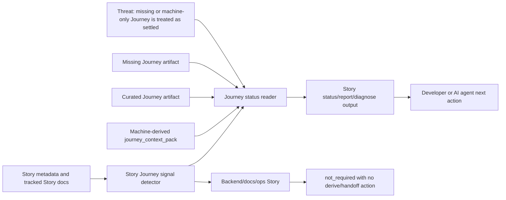

# VibePro Story Journey Diagnosis Spec

## Scope

This spec covers Story-level Journey visibility for `vibepro story status`, `vibepro story report`, and `vibepro story diagnose`.

It does not change PR Gate DAG ownership. PR gating for changed files remains owned by `pr-manager` and continues to require `gate:journey_context` only for UI source changes.

## Invariants

- `INV-SJD-1`: A Story with UI/Journey signals MUST include `journey_context.required=true` in Story status/report/diagnose output.
- `INV-SJD-2`: If no Journey artifact exists for a required Story, the status MUST remain `missing`; it MUST NOT be flattened to pass, empty, or unavailable-without-action.
- `INV-SJD-3`: A machine-derived `journey_context_pack` MUST be reported separately from a curated Journey.
- `INV-SJD-4`: A Story without UI/Journey signals MUST be reported as `not_required` and MUST NOT emit Journey derive/handoff next actions.
- `INV-SJD-5`: PR Gate DAG behavior MUST remain unchanged: `gate:journey_context` is required only for UI source changes.

## Contracts

`story status`, `story report`, and `story diagnose` return a `journey_context` object with:

- `required`: boolean
- `status`: `not_required`, `missing`, `needs_curated_journey`, `available`, `needs_evidence`, or `conflict`
- `artifact_kind`: `journey_context_pack`, `curated_journey`, or `null`
- `curated`: boolean
- `curation_status`: Journey curation state
- `handoff_available`: boolean
- `journey_id`: Journey identifier
- `reason`: human-readable reason
- `detection`: matched Story signals and source docs
- `next_actions`: commands or file actions when Journey is required but incomplete

## Scenarios

- `SJD-SCENARIO-1`: A UI Story with no Journey artifacts shows `missing` and next actions for derive, handoff, and curated Journey creation.
- `SJD-SCENARIO-2`: A UI Story with only `.vibepro/journey/latest-journey.json` shows `needs_curated_journey` and `artifact_kind=journey_context_pack`.
- `SJD-SCENARIO-3`: A UI Story with `.vibepro/journeys/default-product-journey.json` shows a curated Journey with `artifact_kind=curated_journey`.
- `SJD-SCENARIO-4`: A backend Story without UI/Journey signals shows `not_required` and no Journey commands.

## Diagrams

### Threat Model

## Anti-Patterns

- Do not infer that all docs-only Stories require Journey context.
- Do not treat a machine-generated Journey context pack as a curated Journey.
- Do not move or broaden PR Gate DAG Journey enforcement while adding Story-level visibility.
- Do not hide missing Journey context behind a generic Story report success.

## Verification

- `test/vibepro-cli.test.js` covers `INV-SJD-1` and `INV-SJD-2` with a UI Story missing Journey context.
- `test/vibepro-cli.test.js` covers `INV-SJD-3` with machine-derived and curated Journey artifacts.
- `test/vibepro-cli.test.js` covers `INV-SJD-4` with a backend Story.
- Existing `test/journey-map.test.js` covers `INV-SJD-5` for PR Gate DAG Journey behavior.
