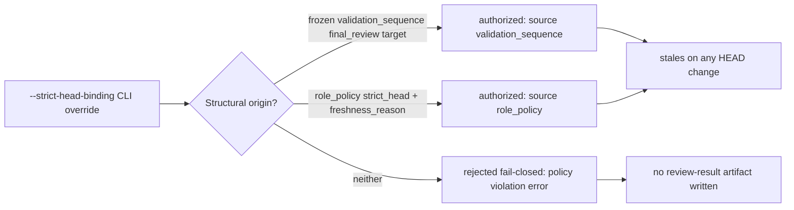

# Strict HEAD Binding Origin Guard Spec

## Invariants

- `INV-001`: `vibepro review record` MUST reject a `--strict-head-binding` CLI
  override for a role whose configured `freshness_mode` is `content_surface`
  (not `role_policy` strict_head, not the frozen validation-sequence
  `implementation:runtime_contract` final_review target), failing closed
  with an explicit policy-violation error instead of recording strict
  binding.

## Scenarios

- `S-001`: Given an active, frozen validation-sequence state whose plan is
  required and whose `frozen_binding` matches the current HEAD, a
  `review record --strict-head-binding --strict-head-reason <text>` for
  stage `implementation` role `runtime_contract` (the fixed final_review
  target) is authorized and its persisted `freshness_policy` has
  `effective_mode: strict_head` and `source: validation_sequence`.
- `S-002`: Given a role policy that declares `freshness_mode: strict_head`
  with a non-empty `freshness_reason`, `review record` for that role without
  any `--strict-head-binding` CLI flag is authorized, and its persisted
  `freshness_policy` has `effective_mode: strict_head`,
  `source: role_policy`, and `reason` equal to the configured
  `freshness_reason`; the same role without a configured `freshness_reason`
  is rejected.
- `S-003`: A `content_surface`-configured review (e.g.
  `preview:human_usability`) stays `binding_status: current` after a commit
  that does not touch its recorded inspected surface files, and becomes
  `binding_status: stale` once one of those recorded surface files' content
  changes.

## Contracts

- `C-001`: `pr prepare`'s `gate:pr_freshness` reports
  `content_binding_details.bindings[].strict_head_origin`
  (`validation_sequence` | `role_policy` | `cli_override` | `unknown` |
  `null`) for every `strict_head` `agent_review` binding, and emits a
  warning prefixed `VibePro strict HEAD binding origin:` naming the
  `stage:role` for every binding whose `strict_head_origin` is
  `cli_override`; it does not warn for `validation_sequence`- or
  `role_policy`-authorized bindings.
- `C-002`: `review prepare`'s `parallel_dispatch.record_commands`, the
  rendered `parallel-dispatch.md`, and each rendered
  `review-request-<role>.md` never include `--strict-head-binding` for a
  dispatched role, even when that role is currently authorized (by
  `role_policy` or an active frozen validation-sequence final_review
  target) to record strict HEAD binding at record time; only
  `review status` / `pr prepare` remediation `record_command` fields
  conditionally include `--strict-head-binding`, gated by
  `isStrictHeadBindingAuthorizedNow`.

## Threat Model

## Code and Test References

- `src/agent-review.js`: `resolveReviewFreshnessPolicy`, `isRecordedStrictHeadStillAuthorized`, `isStrictHeadBindingAuthorizedNow`
- `src/validation-sequencing.js`: `getFinalReviewTarget`, `isFrozenFinalReviewTarget`
- `src/pr-manager.js`: `resolveStrictHeadOrigin`, `STRICT_HEAD_ORIGIN_WARNING_PREFIX`
- `test/content-scoped-evidence-freshness.test.js`
- `test/e2e/story-vibepro-strict-head-binding-origin-guard-main.test.js`
