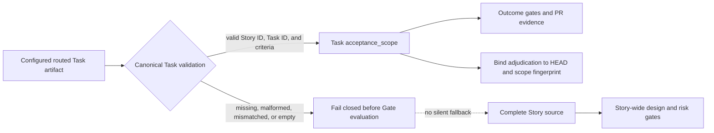

# Spec: Task-scoped PR acceptance authority

## Contracts

### TSPA-CONTRACT-001 Acceptance scope

`pr prepare` emits `pr_context.acceptance_scope` with:

- `source`: `task` or `story`
- `story_id`
- `task_id`: selected Task ID or `null`
- `acceptance_criteria`: normalized criterion strings. An explicit Task scope
  requires at least one non-empty criterion; Story fallback preserves the
  existing missing-criteria Gate behavior.

### TSPA-CONTRACT-002 Outcome consumers

Story E2E coverage, Gate DAG acceptance nodes/counts, clause traceability,
evidence adjudication, and senior gap acceptance counts consume the acceptance
scope. Evidence adjudication requests and recorded verdicts expose the
normalized scope plus a deterministic scope fingerprint. A verdict is reusable
only when its HEAD and scope fingerprint both match the current PR preparation.
Task-scoped human closures use the scope fingerprint in their decision source;
an unscoped or differently scoped closure does not satisfy the Task gate.

### TSPA-CONTRACT-003 Story-wide consumers

Story source integrity, Architecture, Accepted Spec, requirement consistency,
risk classification, and responsibility authority continue to consume the
complete Story source.

### TSPA-CONTRACT-004 Routed task plan

PR Task lookup resolves the configured `task_plan` artifact route. When the
canonical route is JSON it reads that file; legacy Markdown routing keeps using
the established `.vibepro/stories/<story-id>/tasks/tasks.json` machine state.

### TSPA-CONTRACT-005 Fail closed

An explicit Task request fails before Gate evaluation when the routed task plan
is absent, the Task ID is absent, or the selected Task has no non-empty
acceptance criteria. It never falls back to Story acceptance criteria.

## Diagrams

### TSPA-DIAGRAM-001 Task acceptance trust boundary

The routed Task artifact is an input boundary rather than an authority to
rewrite Story design. Missing, malformed, mismatched, or empty Task data is
rejected before Gate evaluation. Only validated criteria enter Task-scoped
outcome evidence; the complete Story remains authoritative for design and risk
checks.

### TSPA-STORY-005 Same HEAD, different Task

Given Task A and Task B are prepared from the same commit and both number their
first criterion `ac:1`, when Task A has a demonstrated adjudication verdict and
PR preparation switches to Task B, then Task B remains `needs_evidence` until
an independent verdict is recorded for Task B's acceptance scope.

## Scenarios

### TSPA-STORY-001 Current Task complete, later Task incomplete

Given a Story has a completed current Task and a later incomplete Task, when PR
preparation selects the current Task, then outcome evidence contains only the
current Task criteria while Story-wide design consistency still uses the full
Story.

### TSPA-STORY-002 No Task selected

Given PR preparation does not select a Task, when gates are constructed, then
the Story acceptance criteria remain authoritative.

### TSPA-STORY-003 Routed feature task plan

Given a feature packet routes its canonical task plan outside the legacy Story
directory, when PR preparation selects a Task, then it reads the routed
canonical JSON without requiring a compatibility copy.

### TSPA-STORY-004 Invalid Task acceptance

Given an explicit Task has no usable acceptance criteria, when PR preparation
starts, then it fails with a Task-specific error before emitting misleading
Story-scoped readiness evidence.
