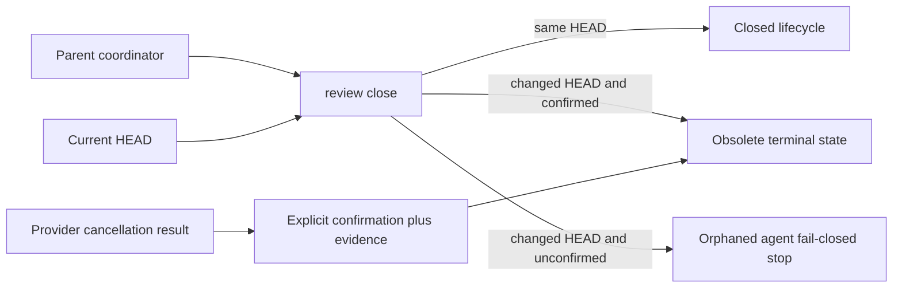

# Trusted Delivery Efficiency Guardrail Spec Lineage

The executable clause source is
`docs/specs/story-vibepro-trusted-delivery-efficiency-guardrail.vibepro.json`.
This companion document provides the Design SSOT lineage that the Markdown
frontmatter reconciler requires.

## Contract mapping

- C-001: budget evaluation preserves unknown values, keeps exceptional migration allowance Story-local, and emits typed stops.
- C-002: review dispatch is freeze-bound and idempotent per Story/stage/role/HEAD/surface.
- C-003: `agent-review` fails stale running work closed and persists explicit obsolete terminalization.
- C-004: compatible findings share one repair dispatch, targeted verification, and independent re-review.
- C-005: `story-run-portfolio` separates overlapping review wall-clock from summed agent consumption.
- INV-001: `pr-manager` exposes efficiency debt without weakening correctness readiness.
- C-006: Review coverage follows concrete UI/network surfaces and a single checkpoint owner, while final gate/release judgment remains independent.

## Failure and trust boundary

The parent coordinator cannot turn its own cancellation request into provider confirmation. A changed-HEAD lifecycle stays orphaned until explicit confirmation and evidence are both present.

## Runtime owners

`src/agent-review.js`, `src/pr-manager.js`, and `src/story-run-portfolio.js`
consume the shared policy in `src/delivery-efficiency-guardrail.js`. The
canonical JSON Spec binds these owners to their integration tests.
