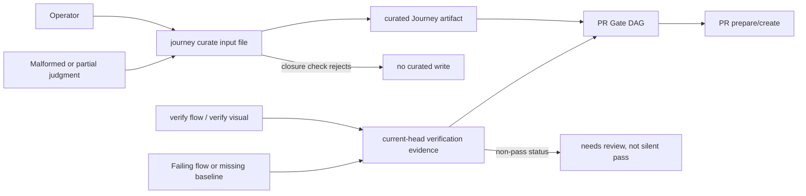

# Spec

## Invariants

### UJD-INV-1: Real change, real project

The dogfood subject MUST be an actual UI change in a real project with a UI
surface. A synthetic or throwaway change does not satisfy this story.

### UJD-INV-2: No waivers on the two target gates

`gate:visual_qa` and `gate:journey_context` MUST be resolved through evidence.
A run that resolves either gate via waiver does not count as completing the
route.

### UJD-INV-3: VibePro-only route

The run MUST reach merge through `vibepro execute merge`. Bypassing the flow
with raw `gh pr create` or a manual merge invalidates the dogfood claim.

### UJD-INV-4: Targets are declared before the run

The numeric targets (manual command count measured, zero raw-JSON hand-edits,
both gates resolved without waivers) MUST be recorded before the run starts.
Success is judged by reconciling outcomes against the prior declaration, not
by post-hoc narrative.

## Contracts

### UJD-CONTRACT-0: Producer commands freeze the dogfood route

`vibepro journey curate`, `vibepro verify visual`, and the passing
`vibepro verify flow` screenshot bridge MUST provide the route producers used
by this dogfood story. They are additive CLI contracts: existing
`journey derive`, `journey handoff`, `verify flow`, and manual
`verify record` behavior remains valid.

### UJD-CONTRACT-1: Dogfood report contents

The report under `docs/reference/` MUST contain: the full command sequence
used, each point of friction with its workaround, the measured manual command
count, and the reconciliation against the pre-declared targets.

### UJD-CONTRACT-2: Break-to-story conversion

Every break or manual workaround discovered during the run MUST either become
an active follow-up story with acceptance criteria, or be explicitly recorded
in the report as accepted residual friction with a reason. An empty break list
is stated explicitly.

### UJD-CONTRACT-3: Route frozen as a test

An e2e test on a synthetic repository MUST assert each stage of the proven
route: curated Journey present (`journey status` = curated), visual evidence
accepted, `gate:visual_qa` and `gate:journey_context` resolved, and
`execute merge` preconditions met.

### UJD-CONTRACT-4: Basic Auth compatibility boundary

The dogfood route includes the shared `verify flow` producer path. Existing
`BASIC_AUTH_USER && BASIC_AUTH_PASSWORD` runtime support must remain available
for protected preview pages, and no Journey, visual, verification, review, PR,
or merge artifact may persist plaintext Basic Auth credentials.

## Scenarios

### UJD-S-1: Curated journey reaches pr prepare

The real UI story arrives at `pr prepare` with `journey status` returning
curated.

### UJD-S-2: Both target gates resolve on evidence

`gate:visual_qa` and `gate:journey_context` resolve without waivers.

### UJD-S-3: Merge through VibePro

The story completes via `vibepro execute merge` with no flow bypass.

### UJD-S-4: Report reconciles declarations

The dogfood report contains the measured values and the comparison against
the pre-declared targets.

### UJD-S-5: Route regression coverage

The added e2e test fails when any frozen stage (curation, visual evidence,
gate resolution, merge precondition) regresses.

### UJD-S-6: Dogfood workflow state transition

The dogfood route records the workflow state transition from machine-derived
Journey context to curated Journey, current-head visual evidence, PR readiness,
and merge precondition readiness without treating stale or waived evidence as
release-ready.

## Diagrams

### threat_model: Journey and visual evidence producer boundary

The trust boundary is the producer edge into `.vibepro/` artifacts. The
controls are closure validation for curated Journey input, current-head
binding for verification evidence, and non-pass status propagation for visual
or flow failures.

## Anti-patterns

### UJD-AP-1: Feature work smuggled in

Do not implement new product features under this story; gaps found during the
run become follow-up stories, not inline scope creep.

### UJD-AP-2: Success by narrative

Do not claim the methodology is established based on the run "feeling smooth";
only the declared-target reconciliation and the frozen e2e test support that
claim.

## Verification

- The e2e test covers UJD-S-5 stage assertions (story acceptance criterion
  UJD-S-5).
- The dogfood report satisfies UJD-CONTRACT-1 and UJD-CONTRACT-2 by
  inspection during review.
- `vibepro pr prepare` emits a Gate DAG for this story with
  `dag_connectivity=passed`.
