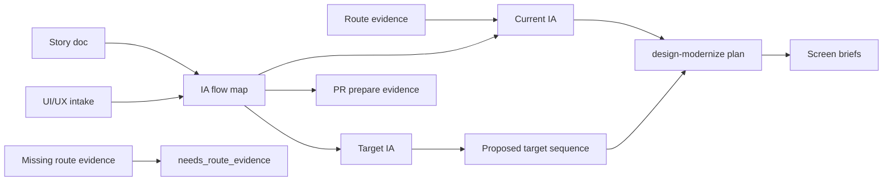

# story-vibepro-uiux-ia-flow-map Spec

## Clauses

- UIFM-S-1: VibePro must provide `uiux map <repo> --id <story-id>` and write `.vibepro/uiux/<story-id>/ia-flow-map.json` plus `.md`.
- UIFM-S-2: The IA flow map must separate current IA from target IA, and target-only flow claims must be marked `proposed` until backed by route, runtime, or implementation evidence.
- UIFM-S-3: `design-modernize plan` must resolve the IA flow map before screen-level briefs and write `.vibepro/design-modernize/<story-id>/ia-flow-map.json`.
- UIFM-S-4: PR preparation evidence must surface the IA flow map status and artifact path for the story.
- UIFM-S-5: Missing route evidence must remain visible as `needs_route_evidence` instead of inventing a complete screen flow.

## Verification

- Unit test `UIFM-S-1 UIFM-S-2 UIFM-S-5 uiux map writes IA flow map and keeps target-only claims proposed`.
- Unit test `UIFM-S-3 design-modernize plan references IA flow map before screen briefs`.
- Unit test `UIFM-S-4 pr prepare surfaces IA flow map evidence path for UI-heavy stories`.
- `npm run typecheck`.

## Diagrams

### information_flow

