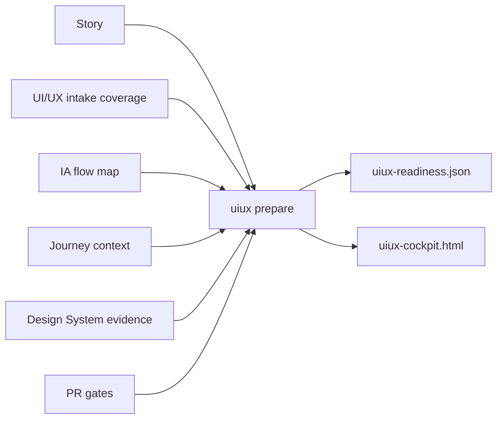
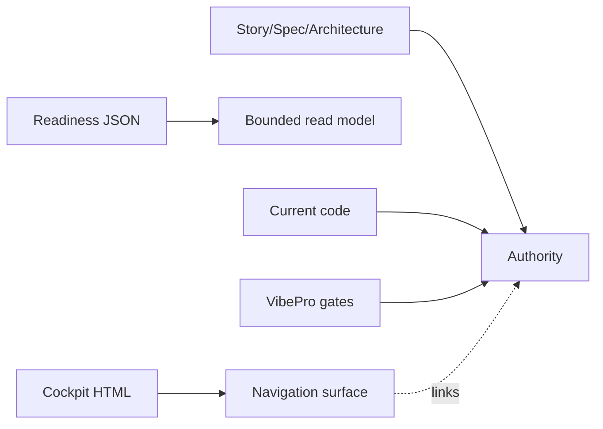

# story-vibepro-uiux-one-command-cockpit Spec

## Clauses

- UIOC-S-1: `uiux prepare` must create story-scoped readiness JSON and cockpit
  HTML under `.vibepro/uiux/<story-id>/`.
- UIOC-S-2: Readiness must report only the allowed statuses `ready`,
  `needs_evidence`, `needs_intake`, `needs_journey`, `needs_design_system`, or
  `blocked`, with explicit reasons.
- UIOC-S-3: Cockpit HTML must link to source artifacts and must not embed full
  JSON dumps as authority.
- UIOC-S-4: A bounded PR prepare view must include pointers to UI/UX readiness
  and cockpit artifacts without making HTML the source of truth.
- UIOC-S-5: `uiux prepare` must be idempotent and safe to rerun on dirty
  worktrees because it only writes `.vibepro/uiux/<story-id>/` artifacts.

## Verification

- Unit test `UIOC-S-1 UIOC-S-2 UIOC-S-3 UIOC-S-5 uiux prepare writes readiness cockpit and reruns on dirty worktrees`.
- Unit test `UIOC-S-4 design-ssot view points reviewers to UI/UX cockpit artifacts`.
- `npm run typecheck`.

## Diagrams

### flow

### authority

