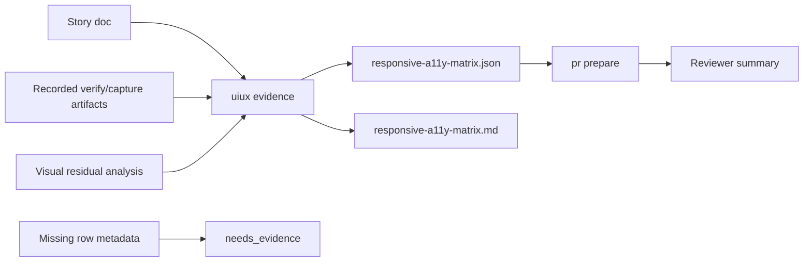
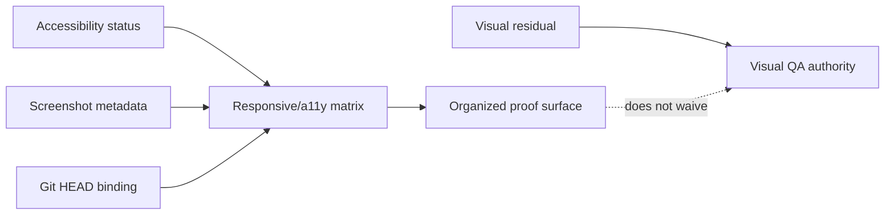

# story-vibepro-uiux-responsive-a11y-evidence-matrix Spec

## Clauses

- UIEA-S-1: VibePro must provide `uiux evidence <repo> --id <story-id>` and
  write `.vibepro/uiux/<story-id>/responsive-a11y-matrix.json` plus `.md` from
  recorded verify/capture artifacts.
- UIEA-S-2: PR preparation must surface the responsive/a11y matrix status,
  artifact path, and missing evidence count for UI-heavy stories.
- UIEA-S-3: Screenshot evidence must not satisfy a matrix row unless the
  recorded artifact includes route, viewport, state, command, and git head
  metadata.
- UIEA-S-4: Accessibility status must be one of `pass`, `fail`, `needs_setup`,
  `auth_required`, `resource_unavailable`, or `missing`; unknown or absent
  status is treated as `missing`.
- UIEA-S-5: Existing visual residual evidence remains authoritative when
  present. The matrix organizes proof and must not become a waiver path for
  visual residual findings.

## Verification

- Unit test `UIEA-S-1 UIEA-S-4 UIEA-S-5 uiux evidence writes responsive and accessibility matrix from recorded artifacts`.
- Unit test `UIEA-S-3 uiux evidence does not accept screenshot-only rows without required metadata`.
- Unit test `UIEA-S-2 pr prepare summarizes missing responsive and accessibility matrix rows`.
- `npm run typecheck`.

## Diagrams

### flow

### authority

