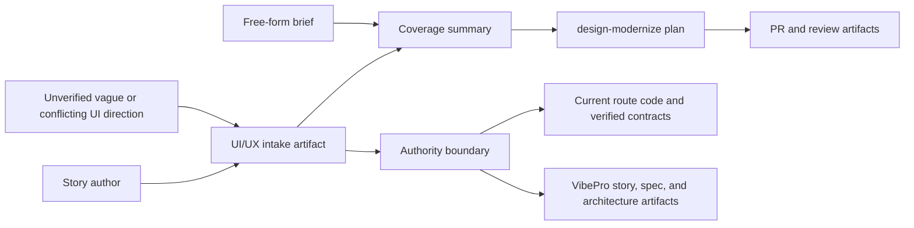

# story-vibepro-uiux-structured-intake Spec

## Clauses

- SI-001: VibePro must provide `uiux intake template` for story-scoped `.vibepro/uiux/<story-id>/uiux-intake.json` and `.md` artifacts.
- SI-002: The intake schema must cover product/service, target users, jobs to be done, business purpose, route scope, current-code authority, desired and avoided impression, visual style, tone, color, typography, component, UI state, spacing/depth, responsive, accessibility, and design-token policies.
- SI-003: `uiux intake validate` must emit machine-readable field coverage with `explicit`, `inferred`, `missing`, and `not_applicable` statuses.
- SI-004: `design-modernize plan` must read the story intake when present and write `.vibepro/design-modernize/<story-id>/uiux-intake-coverage.json`.
- SI-005: Vague-only free-form briefs must surface `needs_intake_detail` guidance while still allowing the plan command to complete.
- SI-006: Coverage output must state that current route code and verified contracts win over intake text when they conflict.

## Verification

- Unit test `uiux intake template and validate writes story-scoped coverage`.
- Unit test `design-modernize plan writes UI/UX intake coverage and flags vague briefs`.
- `npm run typecheck`.

## Diagrams

### threat_model

