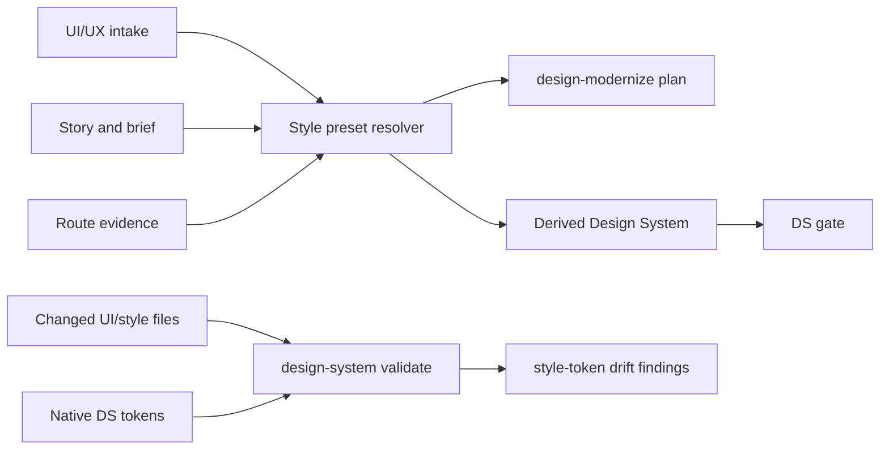
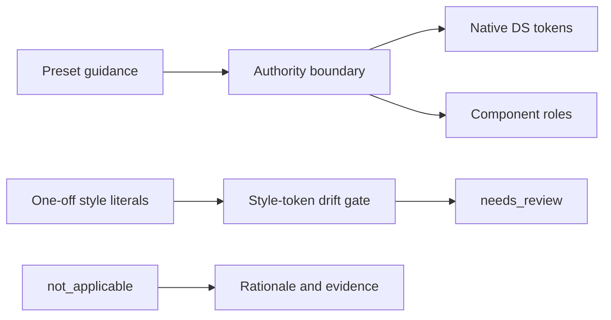

# story-vibepro-uiux-style-preset-token-gate Spec

## Clauses

- UIST-S-1: UI/UX intake and `design-modernize plan` must record the selected
  style preset, selection status, confidence, rationale, and evidence.
- UIST-S-2: The style preset must be reference guidance only; native Design
  System tokens, component roles, Story, Spec, Architecture, route code, and
  VibePro gate evidence remain authoritative.
- UIST-S-3: `design-system validate --base <ref>` must inspect changed UI/style
  files and report one-off color, typography, radius, shadow, or spacing values
  that bypass token policy as style-token drift.
- UIST-S-4: When no stronger product evidence exists, VibePro defaults to the
  operator/developer cockpit preset rather than a marketing landing page.
- UIST-S-5: A Design System may mark style preset coverage `not_applicable`
  only with explicit rationale and evidence.

## Verification

- Unit test `UIST-S-1 UIST-S-4 UI/UX intake and modernize plan record bounded style preset selection`.
- Unit test `UIST-S-2 UIST-S-3 UIST-S-5 design-system validate reports style token drift from changed UI files`.
- `npm run typecheck`.

## Diagrams

### flow

### threat_model

