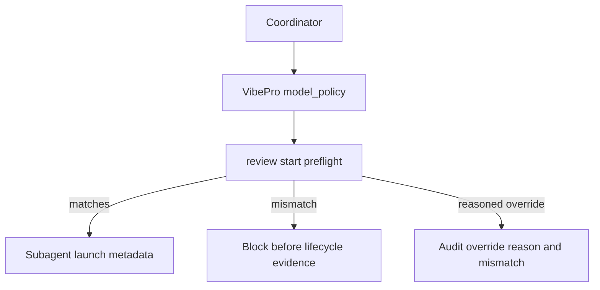

# Spec

## Invariants

- INV-1: VibePro model policy examples MUST use `gpt-5.5` as the standard model generation.
- INV-2: Cost control MUST remain represented by `reasoning_effort` and `cost_tier`, not by downgrading committed examples to a previous-generation model.
- INV-3: VibePro MUST keep exact policy matching semantics and MUST NOT add a model pricing or alias table for this change.

## Contracts

- C-1: `docs/architecture/vibepro-agent-model-policy.md` MUST show `gpt-5.5` in the `agent_reviews.defaults.model_policy.model` example.
- C-2: `test/vibepro-cli.test.js` model policy assertions MUST expect `gpt-5.5`.
- C-3: The preflight rejection fixture MUST still reject a high-effort/high-tier run before lifecycle evidence is created.

## Scenarios

- S-1: A coordinator reading the model policy architecture sees `gpt-5.5` as the baseline model and medium effort/tier as the normal budget signal.
- S-2: A bounded implementation review can use `gpt-5.5` with low effort/tier and still be rejected when a high effort/tier run is attempted without an override reason.

## Anti-patterns

- AP-1: Do not use previous-generation model strings as committed default examples for VibePro model policy.
- AP-2: Do not introduce invented model variant names in committed examples.

## Design Diagram

## Verification

- V-1: `rg -n "gpt-5\\.4|gpt-5\\.4-mini" docs src test README.md README.ja.md package.json` returns no committed example hits.
- V-2: `node --test --test-name-pattern "review policy config publishes role model policy|review start rejects model policy mismatch" test/vibepro-cli.test.js` passes.
