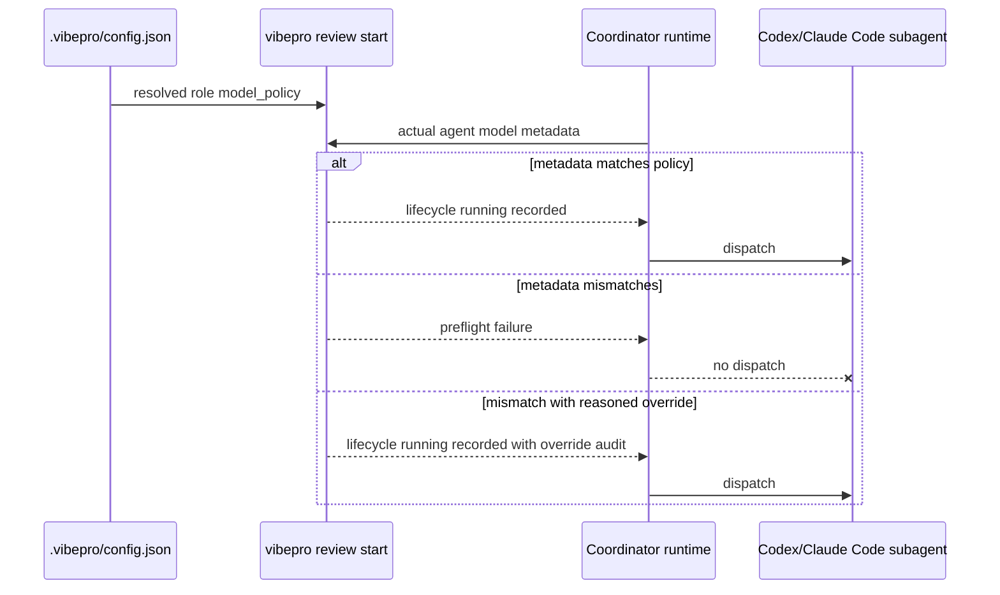

# Spec

## Required Behavior

- `review start` MUST resolve the effective model policy from `agent_reviews.defaults.model_policy` and `agent_reviews.roles.<role>.model_policy`.
- When no effective model policy exists, `review start` MUST preserve existing behavior.
- When a policy field is configured, `review start` MUST require the matching actual CLI field:
  - `model` requires identical `--agent-model`.
  - `reasoning_effort` requires identical normalized `--agent-reasoning-effort`.
  - `cost_tier` requires identical normalized `--agent-cost-tier`.
- When any configured field is missing or mismatched, `review start` MUST fail before lifecycle artifact creation or append.
- `review start` MAY proceed on mismatch only when `--allow-model-policy-override` and non-empty `--model-policy-override-reason <text>` are supplied.
- Override lifecycle evidence MUST include `model_policy_preflight.status = "overridden"`, mismatch details, intended policy, actual launch metadata, and override reason.
- Matching lifecycle evidence MUST include `model_policy_preflight.status = "pass"` when an effective policy exists.

## Invariants

- `INV-AMPP-1`: Preflight enforcement runs before any lifecycle write.
- `INV-AMPP-2`: `review record` actual provenance remains coordinator-supplied and is not inferred from intended policy.
- `INV-AMPP-3`: VibePro does not block repositories that have no configured model policy.
- `INV-AMPP-4`: An override without a human-readable reason is rejected.

## Scenario

