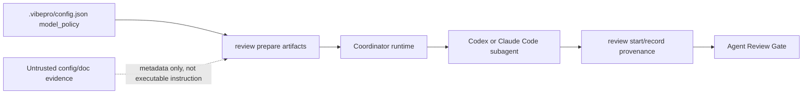

# Spec

## Required Behavior

- `.vibepro/config.json` may define `agent_reviews.defaults.model_policy`.
- `.vibepro/config.json` may define `agent_reviews.roles.<role>.model_policy`.
- A role-level `model_policy` overrides default model policy fields.
- Supported model policy fields are `model`, `reasoning_effort`, and `cost_tier`.
- `reasoning_effort` accepts `low`, `medium`, or `high`; unknown values are ignored.
- `cost_tier` accepts `low`, `medium`, or `high`; unknown values are ignored.
- `review prepare` includes each role's effective `model_policy` in `review-plan.json`.
- Generated `parallel-dispatch.md` and review request files include model guidance only when an effective model policy exists.
- `review start` accepts `--agent-model`, `--agent-reasoning-effort`, and `--agent-cost-tier` and records them in lifecycle evidence.
- `review record` accepts `--agent-model`, `--agent-reasoning-effort`, and `--agent-cost-tier` and records them in agent provenance.

## Invariants

- `INV-AMP-1`: VibePro still does not execute subagents itself.
- `INV-AMP-2`: Existing repositories without model policy config keep the same generated dispatch semantics except for harmless empty/null metadata fields.
- `INV-AMP-3`: Agent Review Gate pass/fail does not depend on the configured model name.
- `INV-AMP-4`: Actual model provenance from `review record` is not fabricated from intended policy when the coordinator does not provide it.

## Design Diagrams

### Threat Model

- Trust boundary: VibePro treats configured model policy as metadata for the coordinator, not as executable instructions.
- Spoofing risk: `review record` must record actual `--agent-model`, `--agent-reasoning-effort`, and `--agent-cost-tier` from the coordinator instead of fabricating them from intended policy.
- Tampering risk: Agent Review Gate must continue to evaluate evidence/provenance, not model names.

## Non Goals

- VibePro does not choose vendor-specific model names automatically.
- VibePro does not price model usage or estimate token spend.
- VibePro does not enforce model availability in Codex, Claude Code, or other external runtimes.
