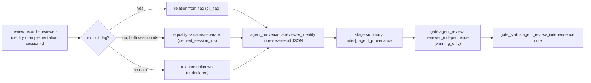
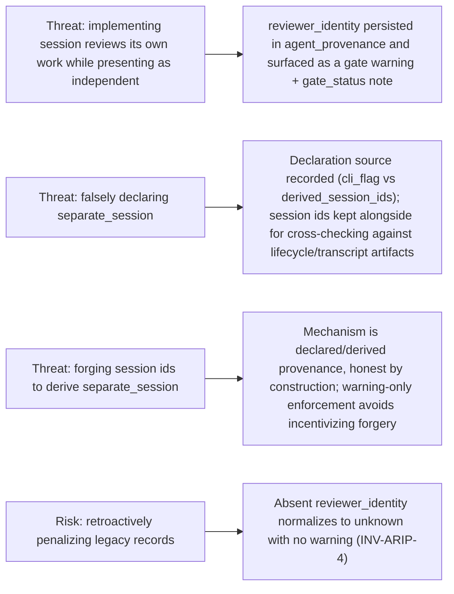

# Spec

## Required Behavior

### `vibepro review record`

- New options: `--reviewer-identity <same_session|separate_session|unknown>`
  and `--implementation-session-id <id>`.
- Every recorded review result's `agent_provenance` gains:
  ```json
  "reviewer_identity": {
    "relation": "same_session" | "separate_session" | "unknown",
    "reviewer_session_id": "<provenance session/thread id or null>",
    "implementation_session_id": "<--implementation-session-id or null>",
    "source": "cli_flag" | "derived_session_ids" | "undeclared"
  }
  ```
- Resolution precedence (`INV-ARIP-1`):
  1. Explicit `--reviewer-identity` (normalized; invalid value throws listing
     the allowed values) -> `source: "cli_flag"`.
  2. Both `implementation_session_id` and a reviewer session id
     (`--agent-session-id`, falling back to `--agent-thread-id`) present ->
     equality decides `same_session` / `separate_session`,
     `source: "derived_session_ids"`.
  3. Otherwise `relation: "unknown"`, `source: "undeclared"`.
- `validateAgentProvenance()` grading is unchanged: reviewer identity never
  downgrades `verified_agent` (`INV-ARIP-2`).

### `vibepro pr prepare`

- Stage summaries already embed each role's `agent_provenance`; the
  `gate:agent_review` node gains:
  ```json
  "reviewer_independence": {
    "enforcement": "warning_only",
    "same_session_review_count": <n>,
    "same_session_reviews": ["<stage>:<role>", ...],
    "unknown_identity_review_count": <n>
  }
  ```
  computed over recorded (non-missing) role results across all stages.
- When `same_session_review_count > 0`, the gate node gains a
  `warnings` entry stating that reviewer independence is not established, and
  `gate_status.agent_review_independence` carries
  `{ status: "same_session_warning", same_session_reviews: [...], note }`.
- When no recorded review is `same_session`,
  `gate_status.agent_review_independence` is
  `{ status: "no_same_session_reviews" }` when reviews exist, or absent/null
  when the gate is N/A.
- Reviewer identity NEVER changes the gate's `status`/`required` or
  `isCriticalUnresolvedGate()` behavior (`INV-ARIP-3`).
- Review records without `reviewer_identity` count as `unknown` and produce no
  warning (`INV-ARIP-4`, backward compatibility).

## Invariants

- `INV-ARIP-1`: Explicit declaration always wins over derivation.
- `INV-ARIP-2`: Provenance strength grading (`strong`/`declared`/`manual`/
  `missing`) is independent of reviewer identity.
- `INV-ARIP-3`: `reviewer_independence` is warning-only; gate pass/fail and
  critical classification are unaffected.
- `INV-ARIP-4`: Artifacts recorded before this change behave exactly as
  before (treated as `unknown`, no warnings).

## Design Diagrams

### flow



### threat_model



## Non Goals

- Does not block or fail the Agent Review Gate on same-session reviews.
- Does not attempt OS/process-level detection of the recording session; the
  mechanism is declared/derived provenance, honest by construction.
- Does not change review lifecycle (start/close) records.
