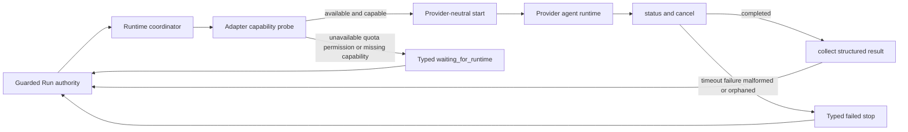

# Agent Runtime Adapter Spec

## Adapter Contract

Adapterは一意な`id`と`probe/start/status/cancel/collect_result`を実装する。Coordinatorはprovider固有moduleをimportせず、登録済みcontractだけを呼ぶ。probe結果はavailability、capabilities、sandbox、approval policyを返す。

## Dispatch Contract

requestはRun/Story/HEAD、task、role、adapter、必須capabilities、positive timeout、managed worktreeを持つ。Guarded Run Sessionはmanaged worktreeをRun authority rootと照合してからdispatchする。Review roleはimplementation identityと異なるreviewer identity、implementation session、read-only capabilityとsandboxを必須とし、`workspace_write`を拒否する。start直後にactual identityとreview session/threadを取得し、結果回収時にidentityとsession/threadがstart応答へ相関すること、implementation sessionとの差異、空の`changed_files`を再照合する。Agent Reviewへの記録直前にも、保存済みsandboxが`read-only`でreview capabilityを持ち`workspace_write`を持たないことを再検証する。同じadapter/task/role/HEAD/reviewer/implementation sessionから生成したdispatch idのrunning/completed recordは再利用し、二重起動しない。

capability不足、unavailable、quota、permission waitは`waiting_for_runtime`。復旧後にproviderがrunningならRun全体をrunningへ戻してstale stop reasonを消す。全provider operationはtimeoutで境界付ける。start timeoutとgeneric start failureはdispatch-id force cancelのterminal acknowledgementを必須とする。cancel後もnonterminalならforce cancelを一度実行し、それでもactiveまたはterminal未確認のagentは`orphaned_agent`としてRunをfail-closedにする。孤立済みdispatchの再要求は同じrecordを返し、`start`を再実行しない。start/status/result timeout、provider failure、不正resultも成功へ変換せずtyped stop reasonを返す。

## Result Contract

successful resultは`completion_status=completed`、changed files、HEAD、test suggestions、summaryを必須とする。Implementation completionのpollは開始時HEADからの遷移を許可するが、報告HEADが実managed worktree HEADと一致した場合だけRun authorityをそのHEADへ再bindする。Review resultは`parallel_subagent`、agent identity、session/thread correlation、`lifecycle=closed`を追加する。これらが欠けたresultはcompletionとして扱わない。

## Persistence Boundary

Coordinatorは更新済み`runtime_dispatches[]`を含むRun stateを返す。Guarded Run Sessionのruntime methodsがauthority-firstでこれを永続化する。Implementation completionでは実worktree HEADとの一致確認後に`current_head_sha`を更新する。completed reviewだけは`recordRuntimeReview`が保存済みdispatchの決定的id、role/status、input/result HEAD、changed files、execution mode、requested/start/result identity、start/result session correlation、implementation session分離、closed lifecycleを現在のRun authorityに対して再検証し、既存Agent Review recording boundaryへ渡す。adapter自身はRun artifact、Gate、PRを直接変更しない。

## Flow

