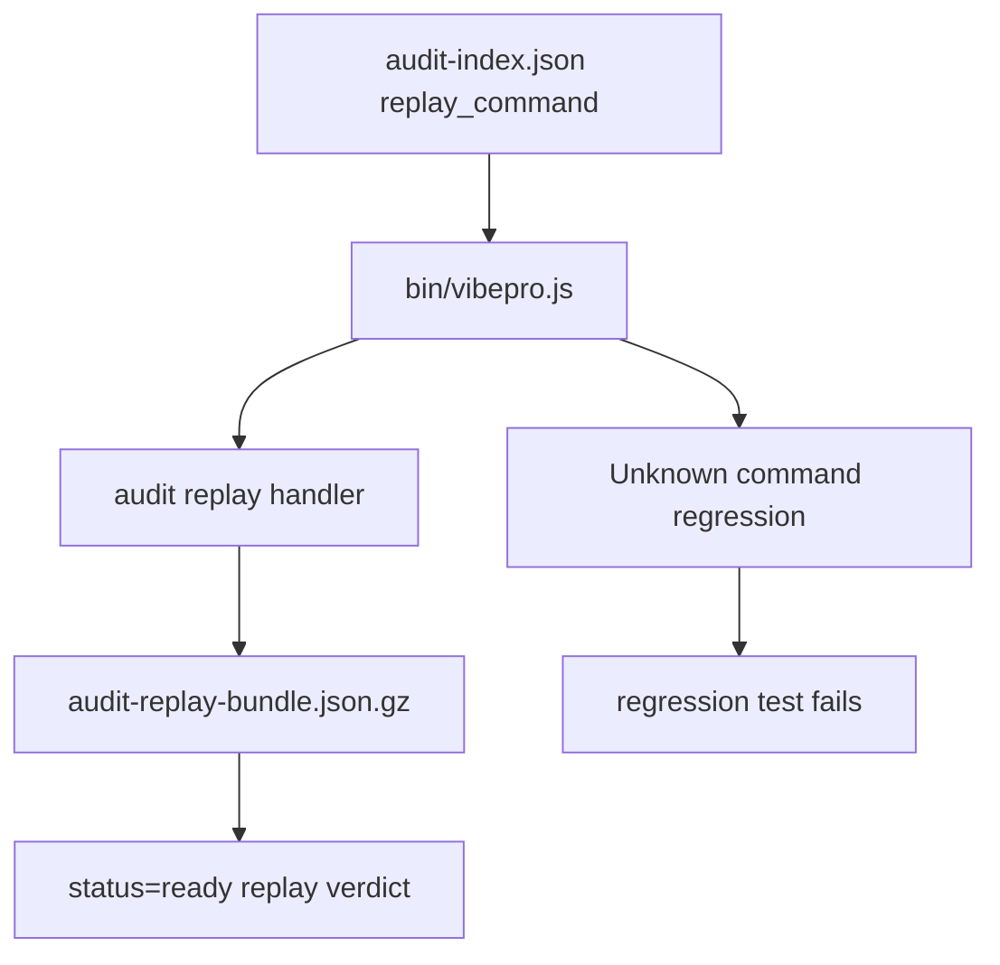

# Spec

## Contracts

- `ARCS-CONTRACT-001`: `audit-index.json` replay metadata MUST declare the public command `vibepro audit replay . --story-id <story-id>`.
- `ARCS-CONTRACT-002`: The declared replay command MUST be executable from a fresh checkout rooted at the artifact repository.
- `ARCS-CONTRACT-003`: The CLI binary path, top-level `audit` dispatch, `replay` subcommand dispatch, and canonical replay implementation MUST be covered as one end-to-end contract.
- `ARCS-CONTRACT-004`: A valid compressed replay bundle MUST return `status=ready` and `handoff_replay_status=ready` through the public CLI.
- `ARCS-CONTRACT-005`: A missing public command MUST fail verification even if lower-level module replay tests still pass.

## Scenarios

- `ARCS-SCENARIO-001`: Given `audit-index.json` declares a replay command, when the test executes that command through `bin/vibepro.js`, then CLI dispatch reaches canonical replay and returns `ready`.
- `ARCS-SCENARIO-002`: Given the top-level `audit` command is removed from the CLI, when the same regression runs, then `Unknown command: audit` causes the test to fail.
- `ARCS-SCENARIO-003`: Given internal replay helpers still work but the binary command surface is disconnected, when replay is verified, then the public command regression fails.

## Diagrams

## Data State Contract

- `migration_plan`: No product data, database schema, cache key, or persisted runtime state migration is introduced. The only committed state is Story/Spec/Architecture documentation, the Design SSOT registry entry, and a regression test.
- `rollback_plan`: Reverting this commit removes the binary-level replay command regression and the related Story/Spec/Architecture docs. Existing canonical audit artifacts and compressed bundles remain unchanged.
- `idempotency_test`: `test/canonical-audit-self-contained.test.js` creates a temporary canonical audit bundle and replays it from the checkout root without mutating the bundle or requiring session `.vibepro/`.
- `query_semantics_test`: The regression executes `vibepro audit replay . --story-id <id>` through `bin/vibepro.js`, which resolves the bundle path from `audit-index.json` relative to the supplied repo root and verifies hashes before returning a verdict.

## Verification

- `ARCS-VERIFY-001`: `test/canonical-audit-self-contained.test.js` runs the replay command declared by `audit-index.json` through `bin/vibepro.js`.
- `ARCS-VERIFY-002`: The test asserts `status=ready`, `handoff_replay_status=ready`, and reconstructed PR prepare/merge verdicts.
