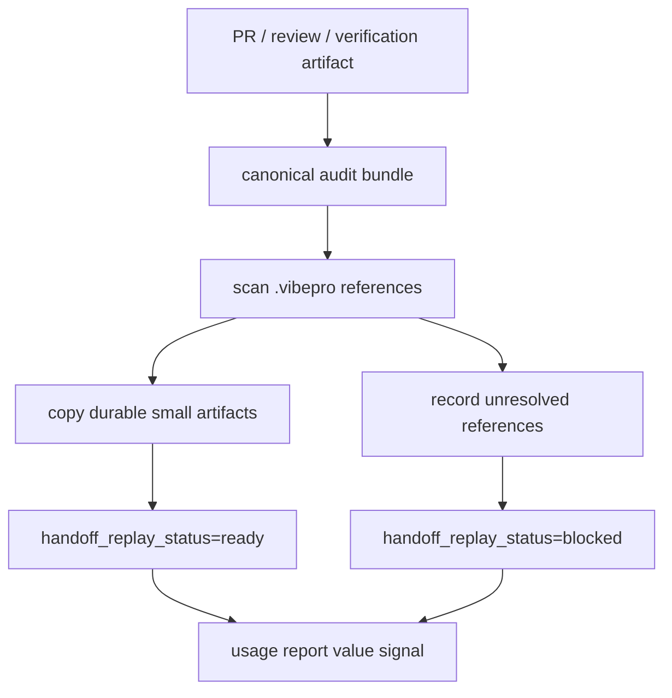

# Spec

## Required Behavior

- `CABSC-001`: `audit-bundle.json` MUST include `handoff_replay_status`.
- `CABSC-002`: `handoff_replay_status` MUST be `ready` only when every required canonical artifact is present.
- `CABSC-003`: unresolved `.vibepro/...` references MUST be recorded in `unresolved_references[]`.
- `CABSC-004`: canonical artifact references MUST prefer `canonical_path` over source workspace paths.
- `CABSC-005`: review and verification artifacts required for handoff replay MUST be copied or summarized under the canonical bundle.
- `CABSC-006`: `usage report` MUST surface blocked handoff replay as a value audit signal.

## Diagrams

`diagrams[]` includes a `flow` diagram because this Story changes the canonical audit artifact promotion and usage-report workflow.

## Scenarios

- `S-001`: Given a fresh checkout without `.vibepro`, when usage report inspects a merged Story bundle, then it can reconstruct PR URL, merge SHA, verification evidence, and review conclusion.
- `S-002`: Given a canonical review summary references a missing `.vibepro` artifact, when bundle validation runs, then `handoff_replay_status=blocked`.
- `S-003`: Given raw provider logs exist in source workspace, when the bundle is promoted, then raw logs are excluded while durable summaries remain available.
