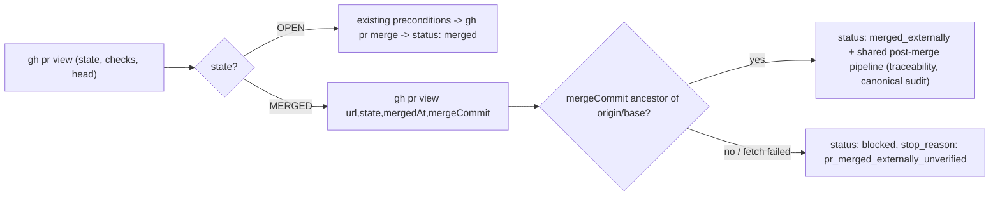
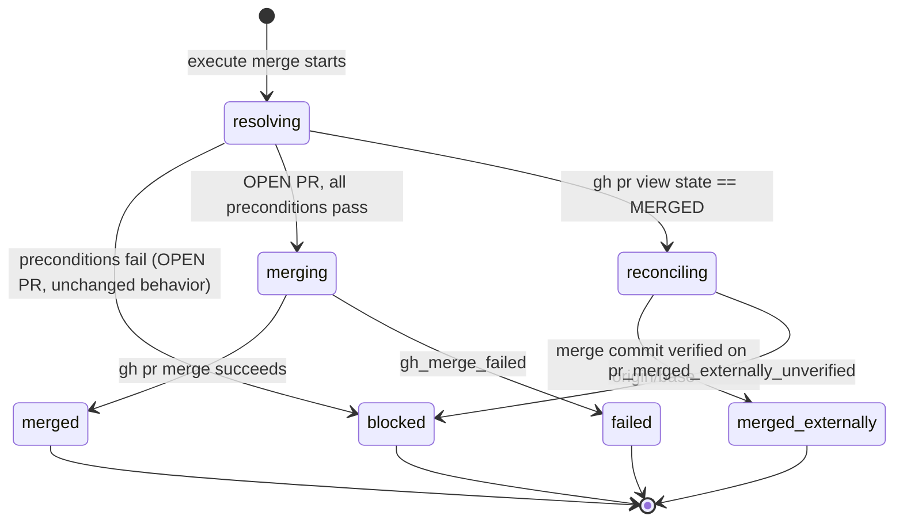
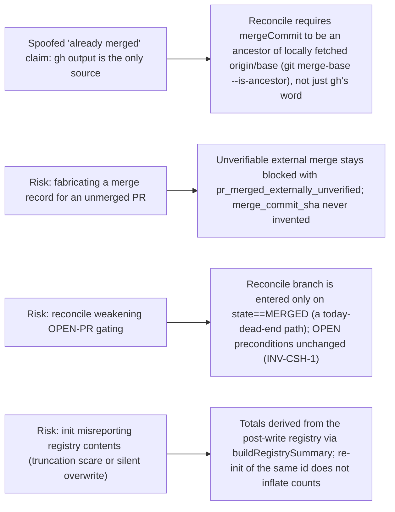

# Spec

## Required Behavior

### `vibepro execute merge` — externally merged PR reconcile

- After the existing `gh pr view` step, when `prView.state === 'MERGED'`:
  - The command does NOT add `base_not_fresh` / `pr_not_mergeable` (or any
    precondition) blocking reasons and does NOT run `gh pr merge`.
  - It fetches the merged view (`url,state,mergedAt,mergeCommit`) — the same
    query the merged path already uses — and populates
    `merge.merge_commit_sha` and `merge.merged_at` from it.
  - It verifies `merge_commit_sha` is an ancestor of `origin/<base>`
    (`gitIsAncestor`). On success:
    - `merge.status = 'merged_externally'`, `merge.stop_reason = null`.
    - A warning records that the PR was merged outside `vibepro execute
      merge` and was reconciled.
    - The shared post-merge pipeline runs unchanged: `pr-merge.json` /
      `pr-merge.html` artifacts, traceability lifecycle promotion to
      `merged` (source `execute_merge`), canonical audit promotion and
      persistence.
  - On failure (merged-view fetch fails, `mergeCommit` missing, or ancestor
    check fails): `merge.status = 'blocked'`,
    `merge.stop_reason = 'pr_merged_externally_unverified'`, no merge record
    fields are fabricated (`merge_commit_sha`/`merged_at` stay null unless the
    merged view supplied them), and artifacts are written for audit.
- When `prView.state === 'OPEN'`, behavior is unchanged from today
  (`INV-CSH-1`).

### `vibepro design-ssot init` — honest registry totals

- `initDesignSsot()` returns a `registry_summary` object computed with
  `buildRegistrySummary()` over ALL normalized roots of the registry it just
  wrote (not only the initialized root):
  ```json
  "registry_summary": {
    "registry_source_count": 1,
    "design_root_count": <total roots after init>,
    "child_link_count": <total child links after init>,
    "required_child_link_count": <total required child links>
  }
  ```
- The CLI human rendering of `design-ssot init` displays
  `design_root_count` / `child_link_count` from `registry_summary`
  (`INV-CSH-2`); the hardcoded `design_root_count: 1` literal is removed.
- Initializing a root into a registry that already has N roots yields
  `design_root_count: N + 1` (or `N` when re-initializing an existing id).

## Invariants

- `INV-CSH-1`: An OPEN PR path through `executeMerge()` is byte-identical to
  today's behavior (same preconditions, same statuses, same artifacts).
- `INV-CSH-2`: Every count printed by `design-ssot init` is derived from the
  registry state read back after the write — no literal counts in the
  presenter.
- `INV-CSH-3`: `merged_externally` is only reported when the merge commit is
  confirmed reachable from `origin/<base>`; otherwise the run stays `blocked`
  with an explicit reason.

## Design Diagrams

### flow



### state



### threat_model



## Non Goals

- Does not add a standalone `vibepro execute reconcile-merge` command; the
  reconcile is a mode of `execute merge`.
- Does not attempt to reconcile CLOSED (unmerged) PRs; those stay blocked.
- Does not change `design-ssot status|coverage|reconcile` output (already
  honest via `buildRegistrySummary`).
