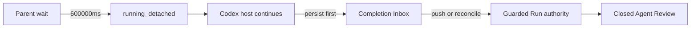
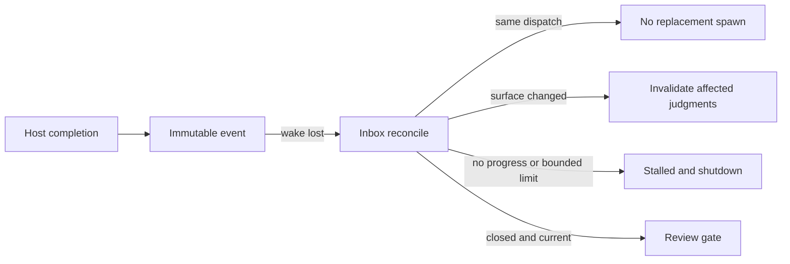

# Codex Detached Completion Inbox Spec

## Contracts

- `600000ms` is a parent monitoring boundary. A running provider becomes `running_detached`; detach never calls host shutdown.
- Completion callbacks persist immutable dispatch-scoped Inbox events before wakeup. Reconcile reads the Inbox even when wakeup is lost.
- `VIBEPRO_CODEX_HOST_MODULE` is the public repo-local CLI binding for a host-owned module. The bridge requires `registerResumeHandler({ resume })`, and missing module exports or handler registration fail closed.
- `execute runtime-dispatch`, `runtime-poll`, and `runtime-reconcile` expose the persisted runtime lifecycle through `node bin/vibepro.js`; `resumeFromWake` is registered automatically rather than manually wired by a caller.
- A logical dispatch is keyed by Run, adapter, task, role, inspection surface, and review identity; budget and evidence timestamps do not create a replacement. A HEAD change requires an explicit unchanged-surface assertion before reuse.
- Concurrent starts share one in-flight dispatch spawn. Partial results are reusable only when their surface hash matches the dispatch; a changed surface without a changed-path proof invalidates prior judgments fail-closed.
- Only checkpoints and completed partial judgments count as progress. No-progress, wall-clock, attempt, and cost limits produce `stalled` and host containment.
- Completed judgments are filtered before host spawn and merged back after completion. Surface changes invalidate judgments whose declared paths intersect changed paths; when changed paths are unavailable, prior judgments are invalidated fail-closed.
- Guarded Run persists detach/reconcile authority-first and keeps the existing closed, separate, read-only Agent Review recording boundary.
- `createCodexGuardedRunBridge` is the production composition boundary for Inbox, adapter, coordinator, Guarded Run, and the injected host implementation. Provider completion correlation must match both dispatch and provider run identity before Inbox persistence.

## Flow

## Threat Model

## Verification

The contract, integration, and E2E surfaces are bound to `test/bin-entrypoint.test.js`, `test/agent-completion-inbox.test.js`, `test/codex-subagent-runtime-adapter.test.js`, `test/guarded-run-session.test.js`, and `test/e2e/story-vibepro-codex-detached-completion-inbox-main.test.js`. Negative coverage includes malformed Inbox JSON, missing host delivery capability, provider/dispatch correlation mismatch, concurrent duplicate start, mismatched completion and partial-result surfaces, surface changes without path evidence, duplicate progress, successor-process bounds, and lost wakeup. The public CLI test resolves the host binding and automatically registers push resume; the E2E no longer assigns `resumeFromWake` by hand.
