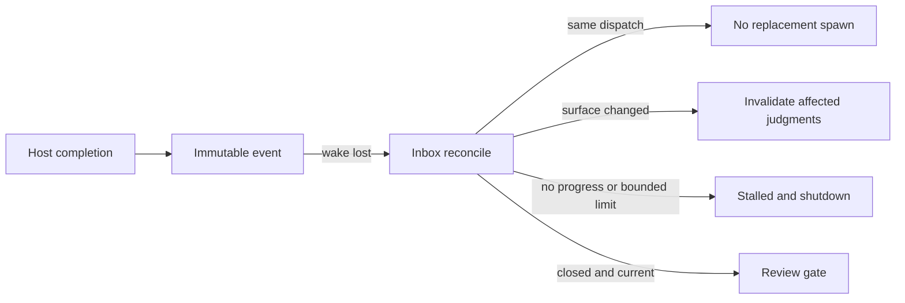

# Codex Detached Completion Inbox Spec

## Contracts

- `600000ms` is a parent monitoring boundary. A running provider becomes `running_detached`; detach never calls host shutdown.
- Completion callbacks persist immutable dispatch-scoped Inbox events before wakeup. Reconcile reads the Inbox even when wakeup is lost.
- A logical dispatch is keyed by Run, adapter, task, role, inspection surface, and review identity; budget and evidence timestamps do not create a replacement.
- Only checkpoints and completed partial judgments count as progress. No-progress, wall-clock, attempt, and cost limits produce `stalled` and host containment.
- Completed judgments are reusable for the same surface. Surface changes invalidate only judgments whose declared paths intersect changed paths.
- Guarded Run persists detach/reconcile authority-first and keeps the existing closed, separate, read-only Agent Review recording boundary.

## Flow

## Threat Model

## Verification

The contract, integration, and E2E surfaces are bound to `test/agent-completion-inbox.test.js`, `test/codex-subagent-runtime-adapter.test.js`, `test/guarded-run-session.test.js`, and `test/e2e/story-vibepro-codex-detached-completion-inbox-main.test.js`.
