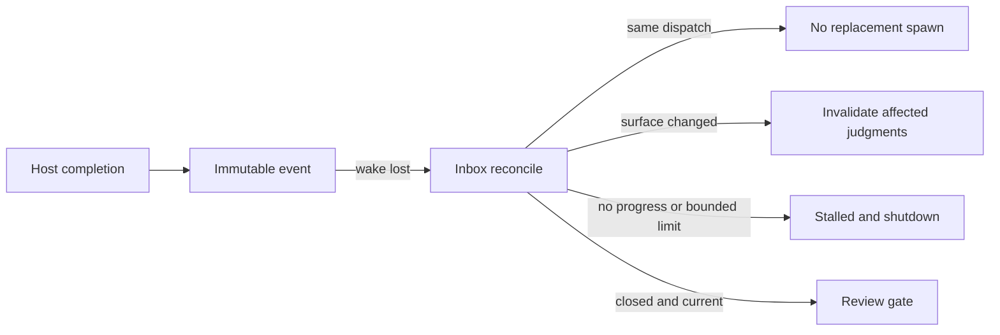

# Codex Detached Completion Inbox Spec

## Contracts

- `600000ms` is a parent monitoring boundary. A running provider becomes `running_detached`; detach never calls host shutdown.
- Completion callbacks persist immutable dispatch-scoped Inbox events before wakeup. The Inbox accepts only a VibePro-owned, type- and size-bounded allowlist schema, preserves canonical structured findings, and rejects unknown or nested non-scalar provider payloads before persistence. Reconcile reads the Inbox even when wakeup is lost.
- The repo-local binary wires the built-in `createCodexSubagentHost` by default; `VIBEPRO_CODEX_HOST_MODULE` is an explicit replacement seam for another host-owned module. The bridge requires `registerResumeHandler({ resume })`, and invalid module exports or handler registration fail closed.
- `execute runtime-dispatch`, `runtime-poll`, `runtime-reconcile`, and `runtime-ingest` expose the persisted runtime lifecycle through `node bin/vibepro.js`. Spawn receives a durable delivery descriptor; after the parent process exits, the host invokes `runtime-ingest`, which revalidates dispatch/provider correlation before Inbox persistence and Run resume. `resumeFromWake` is registered automatically rather than manually wired by a caller. A review dispatch persists a VibePro-owned `review_binding`, and a correlated completion must carry the bounded `review_record` that resume sends through canonical Agent Review recording.
- A logical dispatch is keyed by Run, adapter, task, role, inspection surface, and review identity; budget and evidence timestamps do not create a replacement. A HEAD change requires an explicit unchanged-surface assertion before reuse.
- Concurrent starts share one in-flight dispatch spawn, and the production host uses an atomic dispatch/attempt claim across OS processes. Partial results are reusable only when their surface hash matches the dispatch; a changed surface without a changed-path proof invalidates prior judgments fail-closed.
- Only checkpoints and completed partial judgments count as progress. No-progress can start one next bounded attempt for the same logical dispatch with only unfinished judgments; total wall-clock is not reset between attempts. Wall-clock, attempt, and provider-reported cost limits produce `stalled` and host containment.
- Completed judgments are filtered before host spawn and merged back after completion. Surface changes invalidate judgments whose declared paths intersect changed paths; when changed paths are unavailable, prior judgments are invalidated fail-closed.
- Guarded Run persists detach/reconcile authority-first and keeps the existing closed, separate, read-only Agent Review recording boundary. A successful recording persists a dispatch-scoped `review_gate_record`, while canonical Agent Review results carry the same `runtime_dispatch_id`; duplicate push, reconcile, or recovery after an interrupted marker write therefore reuses the recorded result instead of creating another review history entry. The public host-module entrypoint injects that boundary and fails closed when a bound completion cannot close it.
- `createCodexGuardedRunBridge` is the production composition boundary for Inbox, adapter, coordinator, Guarded Run, and the injected host implementation. Provider completion correlation must match both dispatch and provider run identity before Inbox persistence.
- The built-in host executes `codex exec` in a detached read-only worker with a VibePro-owned prompt/output schema, persists only sanitized state and structured partial/completion events, and attempts repo-local `runtime-ingest`; a parent subscription scan remains the fallback when direct delivery is unavailable.

## Flow

The workflow state transition matrix is `running -> running_detached -> completed -> review lifecycle closed`. A lost push notification keeps the dispatch in `running_detached` until Inbox reconcile advances the same logical dispatch; it never transitions through a replacement spawn.

## Threat Model

## Verification

The contract, integration, and E2E surfaces are bound to `test/bin-entrypoint.test.js`, `test/agent-completion-inbox.test.js`, `test/codex-subagent-host.test.js`, `test/codex-subagent-runtime-adapter.test.js`, `test/guarded-run-session.test.js`, and `test/e2e/story-vibepro-codex-detached-completion-inbox-main.test.js`. The production-host test starts a detached CLI worker through a fake executable at the real process boundary, proves cross-process idempotency and ordered partial/completion delivery, and asserts that raw JSONL is absent from persisted events. Negative coverage includes malformed, nested, oversize, or out-of-schema Inbox data, missing host delivery capability, provider/dispatch correlation mismatch, concurrent duplicate start, mismatched completion and partial-result surfaces, surface changes without path evidence, duplicate progress, successor-process bounds, and lost wakeup. The E2E terminates the parent-side callback and completes through a separate OS process invoking `runtime-ingest`, including a non-empty structured finding, without assigning `resumeFromWake` by hand, then replays the same wake without a second Agent Review side effect. Guarded Run also proves that an existing logical dispatch can rebind to a rebased HEAD only when the caller explicitly asserts an unchanged inspection surface, accept the provider result bound to the recorded predecessor HEAD, and close the review without another spawn.
