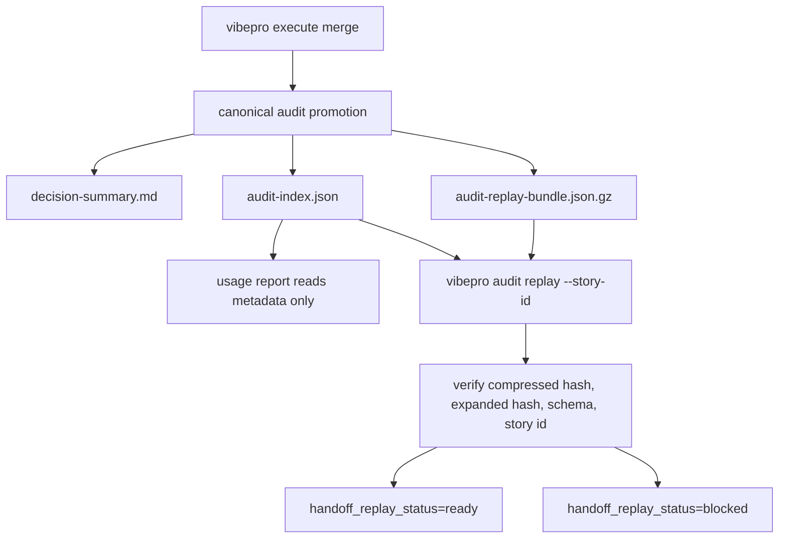

# Compressed Audit Replay Package Spec

## Contracts

- `CARP-CONTRACT-001`: Compact canonical audit promotion MUST write `decision-summary.md`, `audit-index.json`, and `audit-replay-bundle.json.gz` as separate artifacts.
- `CARP-CONTRACT-002`: `audit-index.json` MUST include `replay_bundle.path`, `compression`, `content_hash`, `compressed_hash`, `expanded_bytes`, `compressed_bytes`, `expanded_line_count`, `included_artifact_kinds`, and `replay_command`.
- `CARP-CONTRACT-003`: The compressed replay bundle MUST contain the raw PR/review/verification/traceability data needed to reconstruct the compact decision index without requiring `.vibepro/`.
- `CARP-CONTRACT-004`: `vibepro audit replay <repo> --story-id <id>` MUST verify compressed hash, expanded content hash, schema version, and story id before returning a replay verdict.
- `CARP-CONTRACT-005`: Replay hash mismatch, schema mismatch, missing bundle file, expansion failure, or parse failure MUST return `handoff_replay_status=blocked`.
- `CARP-CONTRACT-006`: `usage report` MUST read compressed bundle metadata from summary/index surfaces without expanding the compressed bundle during normal reporting.

## Invariants

- `CARP-INV-001`: Compression is a storage and handoff mechanism, not a security or trust boundary.
- `CARP-INV-002`: `decision-summary.md` stays human-first and MUST NOT duplicate full Gate DAG or raw review lifecycle JSON.
- `CARP-INV-003`: The compressed bundle is machine-readable replay evidence and does not need to be optimized for direct human reading.
- `CARP-INV-004`: A compact audit with missing source artifacts cannot be considered replay-ready only because a compressed bundle exists.

## Diagrams

`diagrams[]` includes a `flow` diagram because this Story changes the canonical audit artifact promotion and replay workflow.

## Scenarios

- `CARP-S-001`: Given an over-budget canonical audit, when promotion runs, then full raw artifacts are omitted from text history but included in `audit-replay-bundle.json.gz`.
- `CARP-S-002`: Given a fresh main checkout without `.vibepro/`, when `vibepro audit replay` runs against a valid compressed bundle, then it reconstructs PR prepare, merge, verification, review, and traceability summary fields.
- `CARP-S-003`: Given a corrupted compressed bundle, when `vibepro audit replay` runs, then the result is blocked and names the hash or expansion failure.
- `CARP-S-004`: Given a usage report over compact audit artifacts, when no red flag requires deep replay, then it reports compressed and expanded bundle cost without reading full raw evidence.
- `CARP-S-005`: Given `audit-index.json` references the compressed bundle, when replay starts, then the index is the authoritative signal source for bundle path, compression, hashes, schema, and replay command.
- `CARP-S-006`: Given replay is run twice for the same Story and bundle, when no artifact content changes, then the verdict and reconstructed summary remain idempotent.

## Data State Contract

- `migration_plan`: No persistent application data, user records, database schema, or cache key migration is introduced. The only new persisted surface is canonical audit artifact shape under `docs/management/audit-artifacts/`.
- `rollback_plan`: Reverting this commit returns compact canonical audit artifacts to the previous non-replay shape. Existing historical audit artifacts are not rewritten.
- `idempotency_test`: `test/canonical-audit-self-contained.test.js` exercises compact promotion and replay for the same Story without relying on session `.vibepro/`.
- `query_semantics_test`: `test/traceability-usage-report.test.js` verifies normal usage reporting reads replay metadata from summary/index surfaces without expanding the compressed payload.

## Observability Signal Source

The authoritative signal source for replay readiness is `audit-index.json` plus the compressed bundle hashes it records. `decision-summary.md` is a human entry point, not a source of truth for hash, schema, or bundle integrity.

## Verification

- `test/canonical-audit-self-contained.test.js` covers compact bundle generation, replay success, and corrupted bundle blocking.
- `test/traceability-usage-report.test.js` covers usage-report cost rendering without bundle expansion.
- `test/cli-smoke.test.js` covers `audit replay` command wiring.
