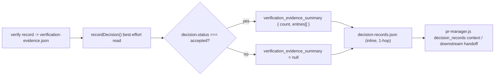

# Spec

## Required Behavior

- `recordDecision()` reads `.vibepro/pr/<story>/verification-evidence.json` for the
  same `storyId` (best-effort; missing file is not an error).
- When the decision's normalized `status === 'accepted'`, the decision object gains:
  ```json
  "verification_evidence_summary": {
    "count": <number>,
    "entries": [
      { "path": "<workspace-relative artifact path or verification-evidence.json path>", "type": "<verify kind>", "result": "<verify status>" }
    ]
  }
  ```
  built from every entry in `verification-evidence.json`'s `commands` array (most
  recent first, matching the file's own ordering).
- When `status !== 'accepted'`, the decision's `verification_evidence_summary`
  field is `null`.
- When no `verification-evidence.json` exists for the story, an accepted decision
  still gets `verification_evidence_summary: { count: 0, entries: [] }`.
- `path` for a command entry is the command's own `artifact` (workspace-relative)
  when present, otherwise the workspace-relative path to
  `verification-evidence.json` itself.

## Invariants

- `INV-DRES-1`: Building the summary never throws for a missing/corrupt
  `verification-evidence.json`; it degrades to `{ count: 0, entries: [] }`.
- `INV-DRES-2`: The summary is computed at `recordDecision()` time and persisted
  inline in `decision-records.json`; no separate summary artifact file is created,
  keeping retrieval to a single hop.
- `INV-DRES-3`: Non-accepted decisions are unaffected byte-for-byte except for the
  added `verification_evidence_summary: null` field.

## Design Diagrams

### Data Flow



## Non Goals

- Does not change `verify record`'s own schema or `verification-evidence.json`
  storage format.
- Does not track evidence for `open`/`rejected`/`superseded` decisions.
- Does not deduplicate or diff evidence across multiple `accepted` decisions for
  the same story; each decision snapshots the evidence available at record time.
