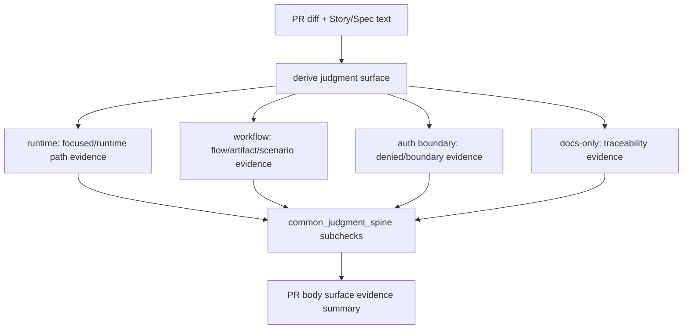

# 仕様

## 必須挙動

- `gate:common_judgment_spine` のsubcheckは `surface`, `required_evidence_kind`, `matched_evidence`, `missing_evidence` を持つ。
- runtime source変更では `focused_test`, `runtime_path_evidence`, `integration_runtime_path`, `e2e_runtime_path` のいずれかがない限り `current_reality` を `needs_evidence` にする。
- workflow/agent orchestration変更では `flow_replay`, `artifact_replay`, `scenario_clause_e2e` のいずれかがない限り `done_evidence` を `needs_evidence` にする。
- auth/permission/session/token/network boundary変更では `auth_denied`, `permission_denied`, `boundary_condition`, `negative_path` のいずれかがない限り `failure_modes` を `needs_evidence` にする。
- docs/spec/story-only変更は `story_spec_traceability`, `doc_reference_integrity`, `impact_scope_explained` のいずれかで軽量passできる。
- genericな `npm test`、`npm run test`、広範なCLI testだけでは、高リスクsurfaceのrequired evidence kindを満たさない。
- PR bodyのEngineering Judgment sectionはsurface別 evidence summaryを表示する。

## Flow Diagram

## 非目標

- 既存のrisk-adaptive Gate DAGを廃止すること。
- subagent reviewの内容を自動採点してrequired evidence kindに変換すること。
