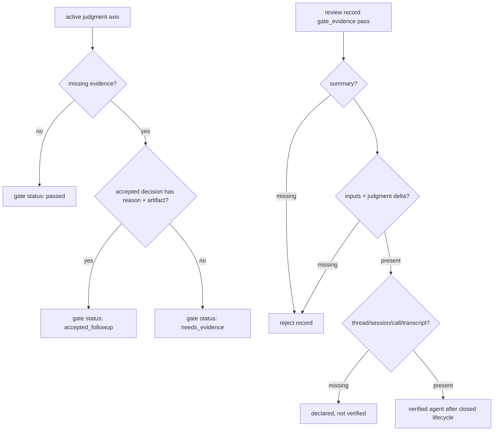

# Spec

## Required Behavior

- `FVH-AXIS-001`: `active_accepted_followup` judgment axes MUST NOT map to a plain `passed` Gate DAG status.
- `FVH-AXIS-002`: A judgment axis Gate DAG node with accepted missing evidence MUST use `status=accepted_followup`, preserve `axis_status=active_accepted_followup`, and include `missing_evidence[]`.
- `FVH-AXIS-003`: `accepted_followup` MUST NOT be counted as unresolved for PR creation by itself, but it MUST be visible in Gate DAG summary counts.
- `FVH-AXIS-004`: A decision record MAY satisfy an axis follow-up only when it is accepted, has a non-empty reason, and includes an artifact reference.
- `FVH-AXIS-005`: An accepted decision without the follow-up minimum fields MUST NOT add `decision_record` evidence to the axis.
- `FVH-REVIEW-001`: Codex/Claude Code `parallel_subagent` provenance MUST be `strong` only when it has thread id, session id, tool/call id, or transcript artifact.
- `FVH-REVIEW-002`: `agent_id` alone MUST classify as declared provenance, not strong provenance.
- `FVH-REVIEW-003`: A `gate:gate_evidence` pass MUST require `inspection.summary`, at least one `inspection.inputs[]` entry, and at least one `judgment_delta[]` entry.
- `FVH-REVIEW-004`: Existing review artifacts with empty `inspection.inputs[]` or `judgment_delta[]` MUST remain readable; this Story tightens only new pass recording.

## Scenarios

- `FVH-SCENARIO-001`: Given a workflow gate state for an active public_contract axis is `active_needs_evidence`, when an accepted decision includes both a safety reason and artifact-backed follow-up, then the Gate DAG state transition becomes `accepted_followup` instead of `passed`.

## Diagram

## Non Goals

- Mandatory human review.
- Automatic judgment quality scoring from transcript contents.
- Making `accepted_followup` blocking in this Story.
