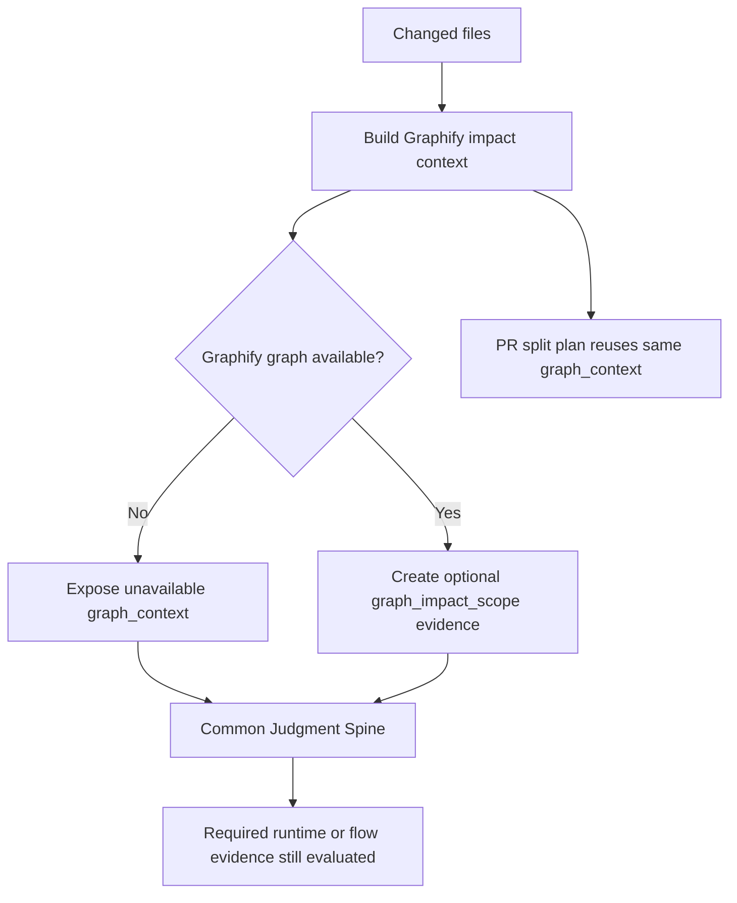

# Spec

## Required Behavior

- `vibepro pr prepare` MUST build one Graphify impact context for the current changed files and expose it in `pr_context.graph_context`.
- If `.vibepro/graphify/graph.json` is missing, Graphify MUST remain optional: Gate DAG readiness MUST NOT fail only because Graphify is unavailable.
- If Graphify is available and at least one changed file maps to graph nodes, `gate:common_judgment_spine.subchecks[]` MUST include `graph_impact_scope` as optional matched evidence for impact-sensitive subchecks.
- `graph_impact_scope` MUST include matched file count, related file count, and a short investigation file list when available.
- `graph_impact_scope` MUST NOT satisfy required behavior/runtime evidence by itself. Runtime and workflow surfaces still require focused tests, runtime path evidence, flow replay, artifact replay, or scenario E2E as already defined.
- `split_plan.graph_context` and `pr_context.graph_context` MUST describe the same Graphify impact context for the same PR prepare run.

## Non Goals

- Requiring Graphify installation.
- Executing Graphify automatically during `pr prepare`.
- Treating Graphify topology as product intent or runtime verification.
- Making missing Graphify a blocking gate.

## Design Diagrams

`diagrams[]` includes a `flow` diagram because this Story changes a multi-step PR preparation and Gate DAG workflow.

