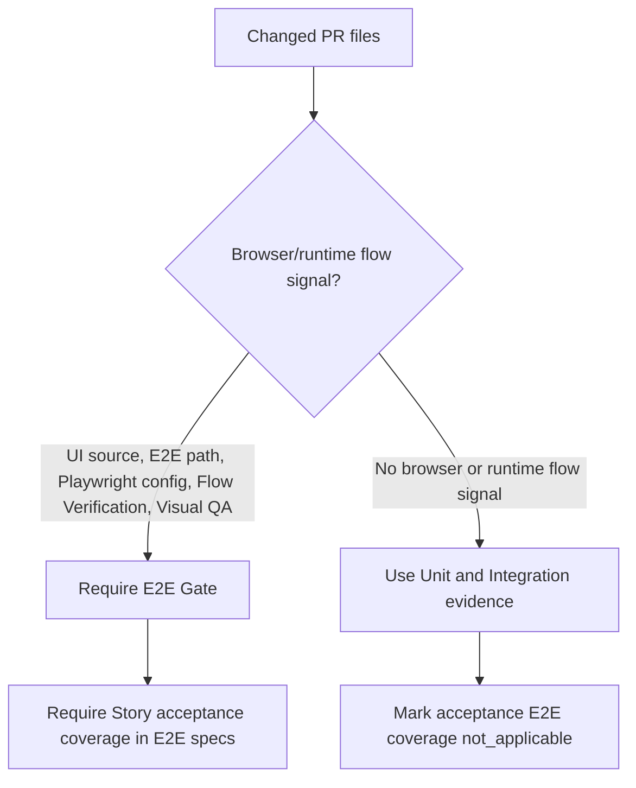

# Spec

## Contracts

- `LEG-CONTRACT-001`: `shouldRequireE2eGate` MUST NOT require E2E solely because `e2eCommand.detected=true`.
- `LEG-CONTRACT-002`: UI source, E2E test path, Playwright config, Flow Verification, and Visual QA changes MUST still require E2E Gate.
- `LEG-CONTRACT-003`: When E2E Gate is not required, `acceptance_e2e_coverage.required=false`, status is `not_applicable`, and missing ACs are empty.
- `LEG-CONTRACT-004`: Story text containing `ADR-unnecessary:` MUST continue to satisfy Architecture Gate.

## Required Verification

- `node --test test/vibepro-cli.test.js --test-name-pattern "unit-layer contract-only acceptance coverage"`
- `node --test test/vibepro-cli.test.js --test-name-pattern "does not require Playwright E2E for CLI-only source changes"`
- `node --test test/vibepro-cli.test.js --test-name-pattern "requires story acceptance criteria coverage in E2E specs"`
- `npm run typecheck`

## Flow Diagram

