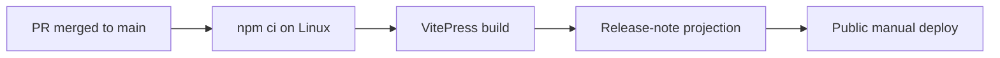
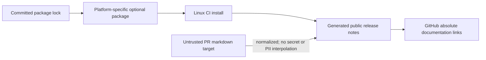

# Linux Rollup CI lock specification

## LRCL-001 Root install contract

The root package must declare `@rollup/rollup-linux-x64-gnu` at the exact Rollup version as an optional dependency.

## LRCL-002 Lockfile artifact contract

The lockfile must contain a resolved `node_modules/@rollup/rollup-linux-x64-gnu` package entry with Linux and x64 platform constraints.

## LRCL-003 Compatibility contract

The dependency remains optional so npm can skip it on incompatible platforms without changing VibePro runtime behavior.

## LRCL-004 Public release-link contract

Release-note projection must convert repository-relative `docs/...` markdown targets to absolute GitHub links before VitePress validates the public manual.

## Diagrams

### Release flow

### Threat model

