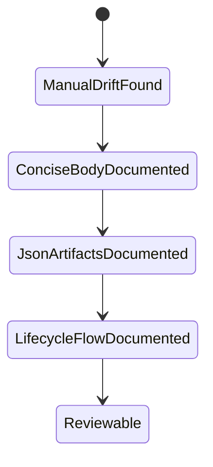
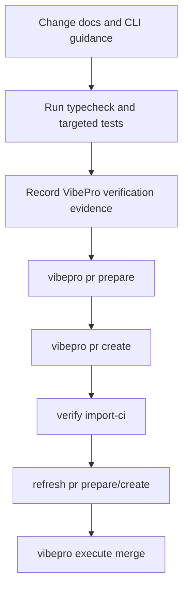

# Spec

## Contracts

- `MPFA-CONTRACT-001`: Manuals, CLI help, and generated handoff guidance MUST describe `pr-body.md` as the concise GitHub decision brief, not as the full audit log.
- `MPFA-CONTRACT-002`: Manuals MUST identify `pr-prepare.json`, `decision-index.json`, `evidence-plan.json`, and `verification-evidence.json` as primary PR review artifacts for agents.
- `MPFA-CONTRACT-003`: Manuals MUST describe `review-cockpit.html`, `gate-dag.html`, and `split-plan.html` as generated only when evidence depth emits them.
- `MPFA-CONTRACT-004`: Manuals MUST include the post-PR lifecycle: wait checks, `verify import-ci`, rerun `pr prepare`, rerun `pr create` to refresh an existing PR, then `execute merge`.
- `MPFA-CONTRACT-005`: Superseded PR body architecture/spec documents MUST point readers to `vibepro-concise-pr-body` for the current GitHub body contract.

## Scenarios

- `MPFA-SCENARIO-001`: Given an agent follows README, it opens the readiness JSON and concise PR body rather than relying on verbose PR body sections.
- `MPFA-SCENARIO-002`: Given evidence-depth summary skips HTML files, the workflow still has JSON artifacts to review and does not treat skipped HTML as missing evidence.
- `MPFA-SCENARIO-003`: Given a PR already exists, the documented workflow refreshes the existing PR body and `pr-create.json` after CI import instead of creating a duplicate PR.
- `MPFA-SCENARIO-004`: Given old PR body docs are read, they explicitly state they are superseded for GitHub PR body rendering.

## Diagrams

## Verification

- `MPFA-VERIFY-001`: Search results no longer describe `pr-body.md` as the place for full Story, risk, Gate, and verification context without distinguishing artifact evidence.
- `MPFA-VERIFY-002`: README / README.ja / CLI help mention or imply `verify import-ci`, rerun `pr prepare` / `pr create`, and `execute merge`.
- `MPFA-VERIFY-003`: Skills mention evidence-depth-aware HTML artifacts and JSON source-of-truth artifacts.

## Release Operations

- `MPFA-OPS-001`: No runtime migration, config change, network contract change, or operator action is required. The change is limited to manuals, CLI help text, and generated handoff wording.
- `MPFA-OPS-002`: Rollback is a normal git revert of the documentation/help commit. There is no data rollback path.
- `MPFA-OPS-003`: Owner-visible evidence is the PR diff plus `npm run typecheck` and targeted CLI/pr-prepare tests recorded in `.vibepro/pr/story-vibepro-manual-pr-flow-alignment/verification-evidence.json`.

## Review Surface

- `MPFA-SURFACE-001`: User-facing manual surfaces are README, README.ja, CLI help, init summary, and PR prepare handoff text.
- `MPFA-SURFACE-002`: Review surfaces are the changed markdown files, `src/cli.js`, `src/html-report.js`, and generated VibePro PR artifacts.
- `MPFA-SURFACE-003`: No persistence, API, UI runtime, billing, auth, or external send path is changed.
