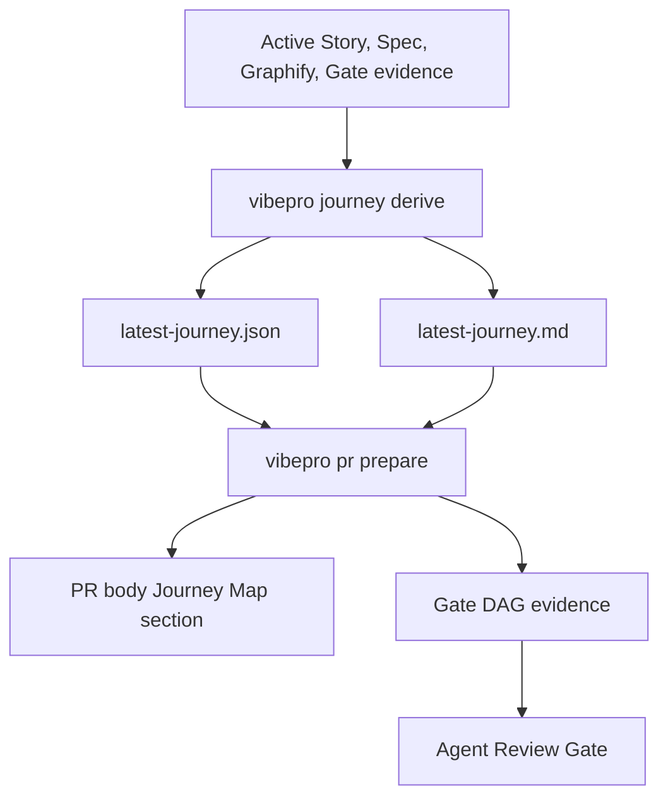

# Patton-style Journey Map Spec

## Invariants

- `INV-PJM-1`: Journey Map generation must not replace or mutate active Story definitions.
- `INV-PJM-2`: `latest-journey.json` must preserve traceability from each Journey step to source Story IDs.
- `INV-PJM-3`: Journey ordering must not be determined from Story timestamps alone.
- `INV-PJM-4`: Product/user-facing Stories may be placed on the Journey backbone; architecture/security/ops/quality Stories must be attachable as enablers or cross-cutting evidence.
- `INV-PJM-5`: Unplaced Stories, journey conflicts, and walking skeleton gaps must be visible in JSON and Markdown outputs.
- `INV-PJM-6`: Existing Story / Architecture / Spec / Gate workflows must remain usable when no Journey Map exists.
- `INV-PJM-7`: Workflow-heavy or product-facing PR evidence must surface Journey Map status when a Journey Map exists.

## Output Contract

`latest-journey.json` must include:

```json
{
  "schema_version": "0.1.0",
  "journey_id": "default",
  "generated_at": "2026-06-02T00:00:00.000Z",
  "source_story_ids": [],
  "source_digest": {},
  "backbone": [],
  "release_slices": [],
  "walking_skeleton": {},
  "unplaced_stories": [],
  "conflicts": [],
  "open_questions": []
}
```

Each `backbone[]` activity must include:

- `activity_id`
- `label`
- `order`
- `steps[]`

Each `steps[]` item must include:

- `step_id`
- `label`
- `story_ids`
- `evidence`
- `confidence`

Each `release_slices[]` item must include:

- `slice_id`
- `label`
- `kind`: `walking_skeleton | next_slice | hardening | custom`
- `story_ids`
- `required_step_ids`

## Scenarios

- `S-PJM-1`: Active product Stories for public discovery, auth, onboarding, and notification generate a Journey backbone ordered by user activity, not by file path or creation date.
- `S-PJM-2`: A security boundary Story attaches to the auth step as an enabler instead of becoming a separate user Journey step.
- `S-PJM-3`: Two active Stories define contradictory post-signup destinations, and the generated Journey includes a conflict.
- `S-PJM-4`: Walking skeleton requires public discovery, signup, and first successful value step; if one is absent, the Journey includes an open question or gap.
- `S-PJM-5`: `pr prepare` on a workflow-heavy change includes Journey Map status without requiring Journey Map evidence for unrelated docs-only changes.

## Design Diagrams

`diagrams[]` includes a `flow` diagram because this Story changes a multi-step workflow that derives Journey evidence, renders it, and feeds it back into PR Gate evidence.



## Anti-patterns

- Do not force every Story into the user Journey backbone.
- Do not treat a category list as a Patton-style Journey Map.
- Do not hide low-confidence Journey placement.
- Do not let Journey Map output override explicit Story, Spec, Architecture, or Gate evidence.
