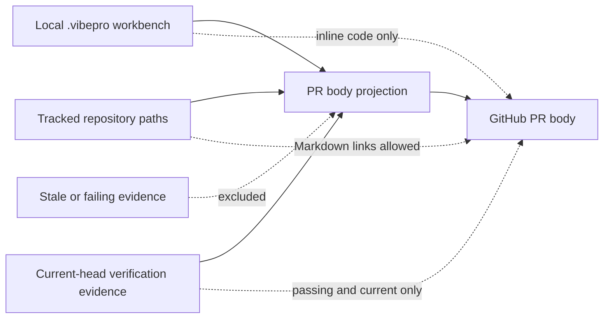

# Spec

## Diagrams

### threat_model

## Contracts

- `PEI-CONTRACT-001`: PR本文の確認欄は、current-headかつpassingのverification evidenceを完了済み項目として表示しなければならない。
- `PEI-CONTRACT-002`: 未完了fallbackは、表示可能なcurrent-head passing evidenceが0件の場合に限り表示しなければならない。
- `PEI-CONTRACT-003`: `.vibepro/` 配下のパスをGitHub Markdown linkとして出力してはならない。
- `PEI-CONTRACT-004`: `.vibepro/` 配下の参照はローカルVibePro workbenchのinline codeとして保持しなければならない。
- `PEI-CONTRACT-005`: `docs/`、`src/`、`test/` など既存のrepo path allowlistに一致する相対パスのMarkdown link契約を維持しなければならない。formatterはfilesystem/Gitの存在確認を行わず、構造化入力の存在・追跡状態は既存のGit差分・Story分類側が保証する。
- `PEI-CONTRACT-006`: Gate DAG、verification binding、PR create/mergeの判定を変更してはならない。
- `PEI-CONTRACT-007`: 通常本文、render後のGate waiver追記、GitHub本文上限超過時のlimit notice、minimal fallback、forced fallbackは同じ公開可能性ルールを適用しなければならない。
- `PEI-CONTRACT-008`: staleなpassing evidenceまたはcurrentなfailing evidenceを完了済み項目の根拠にしてはならない。
- `PEI-CONTRACT-009`: 自由文のMarkdown link構文が壊れていても本文生成は例外終了や文字列欠落を起こしてはならず、検出可能な`.vibepro/` pathを有効なMarkdown linkとして公開してはならない。

## Scenarios

- `PEI-SCENARIO-001`: Given 自動検出commandが0件でcurrent-head passing evidenceがある, when `pr prepare` がPR本文を生成する, then 完了済みevidenceが表示され未完了fallbackは表示されない。
- `PEI-SCENARIO-002`: Given 自動検出commandもcurrent-head passing evidenceもない, when `pr prepare` がPR本文を生成する, then 未完了fallbackが表示される。
- `PEI-SCENARIO-003`: Given direct detail、verification checklist、最終E2E、自由文にplainな`.vibepro/` pathがある, when PR本文を生成する, then pathはinline codeで表示されMarkdown linkにはならない。
- `PEI-SCENARIO-003B`: Given 自由文に既存Markdown形式の`.vibepro/` linkとtracked repo path linkがある, when PR本文を生成する, then `.vibepro/` linkだけinline codeへ正規化され、tracked linkは維持される。
- `PEI-SCENARIO-003C`: Given `pr create --allow-needs-verification` のwaiver reasonにplain/既存Markdown形式の`.vibepro/`参照とtracked repo path linkがある, when render後にGate waiverを追記して投稿用body-fileを選ぶ, then `.vibepro/`参照はinline codeへ正規化され、tracked linkは維持される。
- `PEI-SCENARIO-003D`: Given waiver reasonに閉じ括弧欠落、空href、href内空白を含む壊れたMarkdownがある, when render後にGate waiverを追記する, then 本文生成は成功し、入力のlabelと残余文字列を保持し、検出可能な`.vibepro/` pathはinline codeとなり、有効な`.vibepro/` Markdown linkは生成されない。
- `PEI-SCENARIO-004`: Given `docs/`または`src/`配下のpathがある, when PR本文を生成する, then pathは従来どおりMarkdown linkになる。
- `PEI-SCENARIO-005`: Given stale/passまたはcurrent/fail evidenceしかない, when PR本文を生成する, then そのevidenceを完了済み項目として表示せず未完了fallbackを表示する。
- `PEI-SCENARIO-006A`: Given `## 監査ログ` を含む生成本文がGitHub本文上限を超え、監査ログ省略後は上限内になる, when 投稿用 `pr-body.github.md` を生成する, then strategyは`omit_audit_log_section`となりlimit notice内の`.vibepro/` pathはinline code、Markdown link不在、tracked link維持となる。
- `PEI-SCENARIO-006B`: Given 監査ログ省略後も生成本文がGitHub本文上限を超え、minimal fallbackは上限内になる, when 投稿用 `pr-body.github.md` を生成する, then strategyは`artifact_reference_fallback`となり`.vibepro/` pathはinline code、Markdown link不在となる。
- `PEI-SCENARIO-006C`: Given minimal fallbackもGitHub本文上限を超えるが、強制切り詰め後のsuffixより前に少なくとも1つの`.vibepro/`参照が残るサイズ調整済みfixtureがある, when 投稿用 `pr-body.github.md` を生成する, then strategyは`forced_artifact_reference_fallback`となり、残存する`.vibepro/` pathとsuffixはinline code、Markdown link不在となる。このfixtureは修正前のminimal body由来Markdown linkを残して失敗しなければならない。
- `PEI-SCENARIO-007`: Given 同一fixtureで本文projectionだけを変更する, when `pr prepare` と既存PR enforcementテストを実行する, then Gate readiness、current binding、PR create/merge判定は変更されない。

## Code References

- `src/pr-manager.js`: `renderPrBody`, `renderConciseVerificationChecklist`, `linkifyRepoPathsInText`, `renderFinalE2eConfidence`, `appendGateOverrideToPrBody`, `appendPrBodyLimitNotice`, `buildMinimalGithubPrBody`, `resolvePrBodyForGithub`

## Test References

- `test/vibepro-cli.test.js`: current/pass、証跡なし、stale/pass、current/fail、direct detail、verification、最終E2E、自由文linkifier、壊れたMarkdownの安全なfallback、Gate waiver追記後の投稿body-file、tracked path、GitHub本文上限超過時のaudit log省略limit notice、minimal fallback、forced fallback、Gate/binding不変の回帰テスト
- `test/pr-artifact-size-budget.test.js`: GitHub本文artifactのsize budgetとmetadata契約テスト
- `test/e2e/story-vibepro-pr-body-path-links-main.spec.ts`: 旧path-links契約を公開可能性境界へ更新する静的E2E
- `test/e2e/story-vibepro-pr-body-published-evidence-integrity-main.test.js`: Acceptance Criteria対応のE2E契約テスト
- `test/evidence-depth-pr-prepare.test.js`: evidence depthを保持した本文表示回帰
- `test/risk-adaptive-gate.test.js`: risk-adaptive Gate判定を維持した本文表示回帰
- `test/traceability-promotion.test.js`: traceability promotionを維持した本文表示回帰
- `test/e2e/story-vibepro-design-input-judgment-flow.spec.ts`: design input judgment flowを維持した本文表示回帰
- `test/e2e/story-vibepro-fake-value-hardening-main.spec.js`: fake value hardeningを維持した本文表示回帰
- `test/e2e/story-vibepro-pr-route-gate-dag-main.test.js`: PR route Gate DAGを維持した本文表示回帰
- `test/e2e/story-vibepro-review-dispatch-preflight-dag-main.spec.ts`: review dispatch preflight DAGを維持した本文表示回帰

上記既存テストでは `.vibepro` の本文期待値だけをinline codeへ更新し、Gate固有assertを変更しない。
