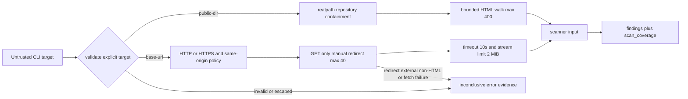

# Spec

機械可読の正本は `docs/specs/story-vibepro-public-discovery-live-targets.vibepro.json`。この文書は人間向け要約。

## Contracts

### PDLT-CONTRACT-001: 入力modeと優先順位

Public Discoveryは `live > built > source` の優先順位でmodeを1つ選ぶ。`--base-url` はlive、`--public-dir` はbuilt、引数無しはsourceを意味する。明示入力の失敗時に別modeへsilent fallbackしない。

### PDLT-CONTRACT-002: built境界

built modeはrepository内の実directoryだけを受け入れ、symlinkを含むrepository外逸脱を拒否する。配下のHTMLを再帰的に最大400件走査し、上限適用前の発見総数とcap除外数を分離して記録する。robots/llms/header evidenceも同じbuild rootから取得する。

### PDLT-CONTRACT-003: live境界

live modeはHTTP(S) GET、同一originのbase rootとsitemap loc、最大40ページ、1応答2 MiB、1要求10秒に限定する。redirect、外部origin、非HTTP(S)、過大応答、取得失敗、壊れたsitemapは検査せずerrorまたはomission evidenceへ残す。

### PDLT-CONTRACT-004: coverage honesty

`scan_coverage` はmode、roots、上限適用前の発見数、検査可能数、選択数、検査数、除外数と理由別集計、失敗数、errors、limits、status、reasonを持つ。検査数0はfindingの有無にかかわらず `inconclusive` であり、項目別finding 0件をpassの証拠にしない。1件以上検査でき、かつblock/review findingがない場合だけcoverageはpassとなる。

### PDLT-CONTRACT-005: findings優先

coverageの件数・失敗・除外証跡と品質findingは独立に保持する。一方、検査数1件以上でblock/review findingがある場合は `scan_coverage.status` とtop-levelの両方を `fail / needs_review` とし、coverage passを残さない。検査数0ではcoverage行を `inconclusive` のまま保ち、top-levelだけ強いfindingを優先する。既存finding ID、severity、suppressionは変更しない。

### PDLT-CONTRACT-006: check artifact

`check public-discovery` と明示target付き `check all` は `public_discovery.coverage` を独立行でJSON/Markdownへ出し、aggregateへ `inconclusive_count` を残す。`inconclusive` は既存契約どおり非ブロッキング。

### PDLT-CONTRACT-007: 操作説明

CLI helpとDiagnosis Package Skillは `--base-url` / `--public-dir`、target layer、0件inconclusiveを説明する。deployed claimはlive、build claimはbuilt evidenceを使用する。

## Non Goals

- JavaScript実行後DOM、認証、フォーム、変更系HTTP
- 外部originやリンクグラフの無制限crawl
- inconclusiveのblocking化
- 既存finding severityの変更

## Verification

`test/public-discovery-live-targets.test.js` が3mode、優先順位、同一origin、上限と除外可視化、timeout、壊れたsitemap、明示エラー、0件inconclusive、findings優先、built/live両CLI経路とartifact表示を検証する。既存Public Discovery回帰テストでsource mode、route分類、metadata継承、suppression互換を検証する。

## Threat Model

