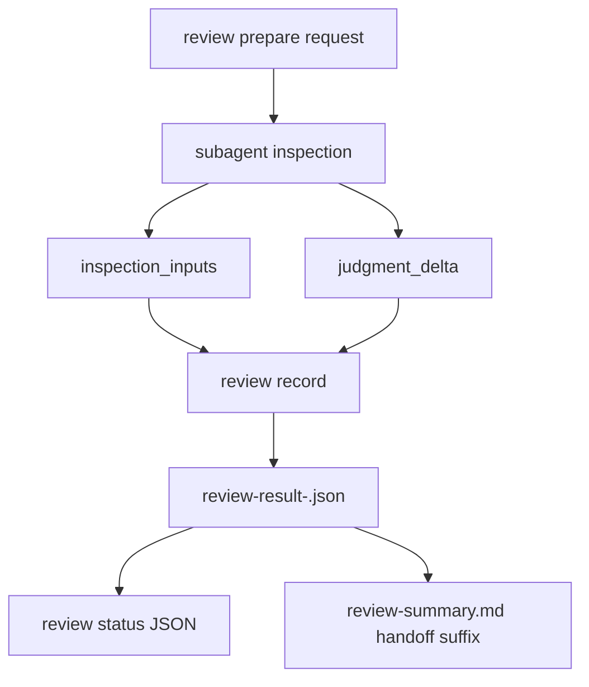

# 仕様

## 必須挙動

- `vibepro review record` MUST accept repeated `--inspection-input <ref>` flags.
- `vibepro review record` MUST accept repeated `--judgment-delta <text>` flags.
- Recorded review result JSON MUST include `inspection.inputs[]`; missing inputs MUST serialize as an empty array.
- Recorded review result JSON MUST include `judgment_delta[]`; missing deltas MUST serialize as an empty array.
- Stage summary roles in `review-summary.json` and `review status --json` MUST surface both fields for each role.
- `review-summary.md` MUST render a compact role-level handoff suffix when either field is non-empty.
- `review prepare` request and parallel-dispatch artifacts MUST ask subagents to return `inspection_inputs` and `judgment_delta`.
- Existing artifacts with `inspection.summary` and `inspection.evidence` but no `inspection.inputs` or `judgment_delta` MUST remain readable.

## Flow Diagram

## 非目標

- review outcomeを新しいfieldだけで自動変更すること。
- `inspection_inputs` をfile pathだけに制限すること。commands、artifact path、logs、URLs、state refsも許容する。
