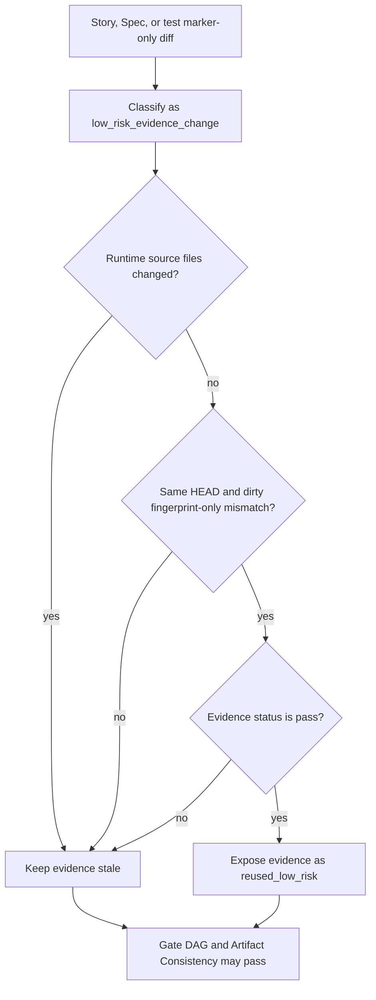

# VibePro Risk-Adaptive Gate DAG Spec

## Change Classification

`vibepro pr prepare` MUST classify every PR context before building the final Gate DAG.

Output:

```json
{
  "schema_version": "0.1.0",
  "profile": "light | api_contract | ui_interaction | workflow_heavy",
  "change_type": "simple_code_change | low_risk_evidence_change | api_contract_change | ui_interaction_change | cross_surface_workflow_change",
  "risk_surfaces": [],
  "reasons": [],
  "required_gate_profile": "light | api_contract | ui_interaction | workflow_heavy",
  "evidence_reuse_policy": {
    "allowed": false,
    "mode": "strict_current_git_binding | path_scoped_low_risk_reuse"
  }
}
```

`workflow_heavy` is selected when multiple runtime surfaces change and Story/diff signals indicate state transition or workflow orchestration risk.

`low_risk_evidence_change` is selected only when the diff has no runtime source files and is limited to Story docs, explicit Spec docs, or test/spec marker files. It remains `profile=light`; it is not a waiver and it MUST keep an auditable reuse policy in the classification output.

Risk surfaces:

- `frontend_interaction`
- `server_api`
- `service_orchestration`
- `database_state`
- `queue_worker`
- `polling_retry`
- `auth_boundary`
- `legacy_v1_compatibility`
- `core_workflow_state`
- `gate_orchestration`
- `verification_evidence`
- `review_lifecycle`
- `test_coverage`

## Gate DAG

`gate-dag.json` MUST include `gate:change_classification`.

For `workflow_heavy`, the DAG MUST also include required gates:

- `gate:workflow_state_machine`
- `gate:production_path_matrix`
- `gate:workflow_flow_replay`
- `gate:evidence_coverage`
- `gate:release_confidence`

These gates are release critical. If any is unresolved, `overall_status` MUST be `needs_verification`.

## Workflow-Heavy Readiness Rules

- Flow Verification pass or current bound E2E/flow verification evidence is required.
- Flow Verification evidence MUST be bound to the current git state before it can satisfy workflow-heavy release readiness.
- Flow Verification MUST preserve existing `BASIC_AUTH_USER && BASIC_AUTH_PASSWORD` env handling without persisting plaintext credentials.
- Current E2E evidence for workflow-heavy readiness MUST execute a story acceptance E2E file with executable assertions; marker-only files do not satisfy flow replay.
- At least one scenario clause is required to represent workflow state transitions.
- `spec.open_questions[].blocker=true` prevents release readiness.
- A passing Unit/API suite does not satisfy workflow-heavy release readiness by itself.

## Low-Risk Evidence Reuse

- Same-HEAD passing verification evidence MAY be reused when the only mismatch is the dirty worktree fingerprint and `change_type=low_risk_evidence_change`.
- Reused evidence MUST be surfaced as `reused_low_risk`, not `current`, in Gate DAG evidence and artifact consistency output.
- Head SHA mismatches, failed evidence, legacy evidence, or runtime source changes MUST remain stale and MUST NOT be reused.
- Test/spec marker changes may require rerunning the changed test file, but MUST NOT force unrelated live external verification by default.
- Docs/Spec-only additions MAY reuse current-head runtime evidence while still requiring the Story/Spec/Requirement gates to pass.

## Design Diagrams

### Flow: Low-Risk Evidence Reuse



## Agent Review

Agent Review policy MUST be risk-adaptive.

For `workflow_heavy`, phase checkpoint review roles include:

- `architecture_spec:regression_risk`
- `test_plan:e2e_ux`
- `test_plan:gate_coverage`
- `implementation:runtime_contract`
- `implementation:ux_completion`

For `workflow_heavy`, PR-final review roles include:

- `gate:release_risk`
- `preview:network_runtime`
- `preview:human_usability`

`preview:preview_smoke` is post-PR evidence because deployed previews normally exist after PR creation; it MUST NOT be a PR-final blocker.

`pr prepare` MUST NOT pull development-phase stages (`architecture_spec`, `test_plan`, `implementation`) into the PR-final Agent Review Gate.

## Tests

- Unit: classifier selects `workflow_heavy` for cross-surface workflow changes.
- Unit: classifier does not over-classify docs-only, API-only, or UI-only changes.
- Unit: classifier selects `low_risk_evidence_change` for Story/Spec/test marker-only evidence changes.
- Integration: `pr prepare` emits workflow-heavy gates and blocks readiness without flow evidence.
- Integration: `pr prepare` marks same-HEAD dirty-fingerprint-only passing evidence as `reused_low_risk` for low-risk evidence changes.
- Integration: Head-mismatched or failed evidence is not reused under the low-risk policy.
- Integration: workflow-heavy checkpoint Agent Review roles include runtime/gate-coverage roles, while PR-final Agent Review roles include gate/preview release-readiness roles.
- Integration: blocker open questions and missing scenario clauses keep release confidence unresolved.
