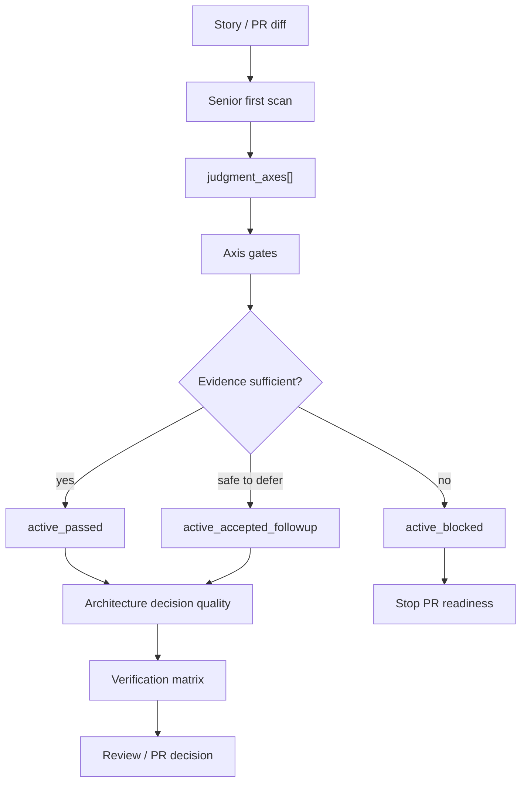

# Spec

## Required Behavior

- `SJ-AXES-001`: `vibepro pr prepare` MUST expose `judgment_axes[]` for Engineering Judgment. This MAY live under `pr_context.engineering_judgment.judgment_axes` or a clearly adjacent context, but it MUST be present in the generated PR artifact.
- `SJ-AXES-002`: `judgment_axes[]` MUST support multiple active axes for a single PR. The implementation MUST NOT collapse all judgment into one exclusive route.
- `SJ-AXES-003`: Each axis item MUST include `axis`, `status`, `reason`, `confidence`, `decision_question`, `required_evidence`, `blocking_criteria`, and `acceptable_followup`.
- `SJ-AXES-004`: The first scan MUST be initial and revisable. A later gate, review, or evidence pass MAY add or escalate an axis when a new risk is discovered.
- `SJ-AXES-005`: Axis statuses MUST distinguish at least `inactive`, `active_needs_evidence`, `active_passed`, `active_accepted_followup`, and `active_blocked`.
- `SJ-AXES-006`: The system MUST include built-in axes for `public_contract`, `rollback_sensitive`, `security_boundary`, `data_state`, `execution_topology`, `ux_surface`, `performance_semantic`, `scope_reviewability`, and `release_ops`.
- `SJ-AXES-007`: `public_contract` MUST activate when API, CLI, config, schema, output format, public docs, PR body contract, or user-visible behavior changes.
- `SJ-AXES-008`: `rollback_sensitive` MUST activate when feature gates, version skew, partial rollout, stored objects, migrations, downgrade, or release-train behavior are detected.
- `SJ-AXES-009`: `security_boundary` MUST activate when auth, permission, secret, token, sandbox, path access, namespace, trust boundary, or security claim changes.
- `SJ-AXES-010`: `execution_topology` MUST activate when process, thread, worker, queue, agent, subagent, retry, deadlock, artifact lifecycle, or orchestration behavior changes.
- `SJ-AXES-011`: Graphify context MUST be optional. Missing `.vibepro/graphify/graph.json` MUST NOT block PR readiness by itself.
- `SJ-AXES-012`: When Graphify is available and matches changed files, the graph impact MUST be available to first scan, scope/reviewability, review ownership, and verification matrix as optional `graph_impact_scope`.
- `SJ-AXES-013`: `graph_impact_scope` MUST NOT satisfy required evidence for runtime correctness, security correctness, rollback safety, UX correctness, or release readiness by itself.
- `SJ-AXES-014`: Architecture decision quality MUST evaluate active axes and report missing `alternatives_considered`, `compatibility_impact`, `rollback_plan`, `boundary`, or `accepted_followups` when relevant.
- `SJ-AXES-015`: Route-specific gates created from active axes MUST NOT default to `passed` solely because the axis exists. They MUST evaluate evidence or explicitly mark the axis as advisory/inactive.
- `SJ-AXES-016`: `acceptable_followup` MUST require a bounded summary, reason why current behavior is safe without it, and a link or artifact reference. Otherwise the missing work MUST be represented as block or waiver.
- `SJ-AXES-017`: PR body and Gate DAG output MUST make active axes human-reviewable: why active, what evidence is required, current status, and what remains.

## Evidence Kinds

- `public_contract`: `compat_matrix`, `defaulting_conversion`, `api_docs`, `release_note`, `old_new_behavior_test`.
- `rollback_sensitive`: `upgrade_downgrade_test`, `feature_gate_disabled_behavior`, `stored_object_update_evidence`, `partial_rollout_plan`.
- `security_boundary`: `threat_model`, `negative_path_test`, `bypass_analysis`, `secret_or_path_boundary_evidence`, `disabled_overhead_evidence`.
- `data_state`: `migration_plan`, `rollback_plan`, `idempotency_test`, `query_semantics_test`, `cross_backend_evidence`.
- `execution_topology`: `topology_diagram`, `deadlock_or_retry_test`, `error_propagation_test`, `side_effect_boundary`, `artifact_lifecycle_evidence`.
- `ux_surface`: `screenshot`, `breakpoint_state`, `accessibility_evidence`, `empty_error_loading_state`, `default_optout_rationale`.
- `performance_semantic`: `benchmark_delta`, `perf_regression_guard`, `semantic_invariant_test`, `soundness_or_layout_proof`.
- `scope_reviewability`: `split_plan`, `review_owner_map`, `related_file_blast_radius`, `decision_bundle_rationale`.
- `release_ops`: `release_note`, `action_required_command`, `rollout_plan`, `rollback_instruction`, `observability_evidence`.

## Design Diagrams

`diagrams[]` includes a `flow` diagram because this Story changes a multi-step Gate DAG workflow.

## Non Goals

- Making Graphify mandatory.
- Replacing all existing route logic in one PR.
- Requiring every axis for every PR.
- Solving every route-specific evidence gate in the first implementation.
- Treating public OSS research artifacts as runtime evidence for VibePro itself.
