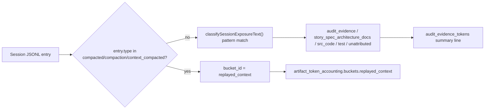

# Spec

## Required Behavior

- `SESSION_EXPOSURE_BUCKETS` gains a `replayed_context` bucket.
- `summarizeSessionExposureEntry()` checks `entry.type` against
  `COMPACTION_REPLAY_ENTRY_TYPES` (`compacted`, `compaction`, `context_compacted`)
  before running pattern-based classification. When the entry type matches, the
  entry's extracted text is classified as `replayed_context` unconditionally,
  bypassing `classifySessionExposureText()`.
- All other entries keep running through `classifySessionExposureText()` exactly
  as before.
- `buildArtifactTokenAccounting()` requires no changes: it already iterates
  `SESSION_EXPOSURE_BUCKETS` generically via `emptyExposureBuckets()` and
  `buckets[event.bucket_id]`, so the new bucket id flows through unchanged.

## Invariants

- `INV-SCCB-1`: Text from a `compacted` entry's `replacement_history` can never be
  classified as `audit_evidence`, `story_spec_architecture_docs`, `src_code`, or
  `test`, even if its content matches those patterns.
- `INV-SCCB-2`: Classification of non-compaction entries is unchanged.
- `INV-SCCB-3`: `replayed_context` tokens are still included in
  `classified_estimated_tokens` (it is real token spend), just isolated from the
  evidence-specific buckets.

## Design Diagrams

### Data Flow

## Non Goals

- Does not attempt to detect compaction from text content heuristics when no
  `compacted`/`compaction`/`context_compacted` entry type is present.
- Does not change token estimation (`estimateTextTokens`) or window filtering.
- Does not change how `unattributed` events are computed.
