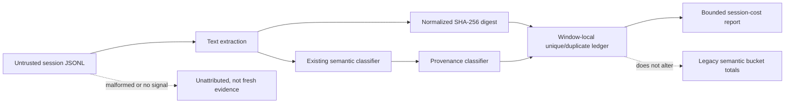

# Spec

## SEXP-S-1 provenance

Given Codex session JSONL entries, when session-cost builds artifact token accounting, then each exposure has one provenance bucket from the five-value closed set.

## SEXP-S-2 digest deduplication

Given repeated normalized transcript content, when accounting is aggregated, then raw estimated tokens remain compatible while unique and duplicate estimates are reported separately by SHA-256 digest.

## SEXP-S-3 mixed tool output

Given one tool output containing signals for multiple semantic buckets, when classified, then its provenance is `mixed_tool_output` and it is not represented as an unqualified fresh read.

## SEXP-S-4 compatibility and failure boundary

Given an existing consumer that reads semantic `buckets`, when provenance accounting is added, then the existing bucket totals remain unchanged and malformed or unmatched transcript entries remain unattributed instead of being promoted to fresh evidence.

## Diagrams

### threat_model

Trust boundary: session text is observational input only. The digest is used for window-local accounting, not identity, authorization, persistence lookup, or cross-session equivalence. Duplicate content remains visible in raw totals and is only excluded from the new unique estimate.

## References

- `src/session-efficiency-audit.js#buildArtifactTokenAccounting`
- `test/session-efficiency-audit.test.js`
