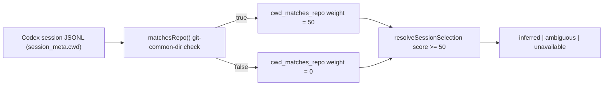

# Spec

## Required Behavior

- `matchesRepo(candidatePath, repoRoot)` remains the single source of truth for
  "is this cwd the same repository" (same resolved path, or same
  `git rev-parse --git-common-dir`). No change to its semantics.
- `summarizeSessionCandidate()` and `mergeSessionCandidateGroup()` assign
  `cwd_matches_repo ? 50 : 0` (raised from 45) toward the session score, so that a
  cwd match alone reaches the `resolveSessionSelection()` confidence threshold
  (`score < 50` is treated as low confidence) without requiring any other signal.
- `resolveSessionSelection()` threshold logic (`score < 50` => low confidence,
  ties => ambiguous) is otherwise unchanged.
- A session whose cwd does not match the repo (no shared git-common-dir, no same
  path) continues to score 0 for this component and is unaffected by this change.

## Invariants

- `INV-STCN-1`: `matchesRepo()` never treats two genuinely unrelated repositories
  (no shared git-common-dir) as matching.
- `INV-STCN-2`: Raising the cwd-match weight cannot cause a non-cwd-matching
  candidate to outscore a cwd-matching one it previously lost to.
- `INV-STCN-3`: Existing ambiguous-tie behavior (`SAI-SCENARIO-002`) and
  cross-repo-mismatch behavior (`SCATTR-SCENARIO-003`) are unchanged.

## Design Diagrams

### Data Flow

## Phase 2 Required Behavior (deleted-worktree normalization)

- `resolveRepoAffinity(candidatePath, repoRoot)` returns
  `{ matches: boolean, method: 'exact'|'git_common_dir'|'managed_worktree_path'|'registered_worktree'|null }`
  and is the single owner of repo-identity truth; `matchesRepo()` delegates to it.
- `SCWN-CONTRACT-002`: `registered_worktree` matching uses
  `git -C <repoRoot> worktree list --porcelain` `worktree <path>` entries
  (including prunable ones) with canonicalized equality or containment.
- `SCWN-CONTRACT-003`: `managed_worktree_path` matching strips the
  `/.claude/worktrees/<name>` or `/.worktrees/<name>` segment from either side
  and requires the stripped canonical roots to be equal; at least one side must
  actually sit inside a managed worktree segment.
- Candidates record `cwd_match_method`; the audit result records
  `observed_worktree_match_method`.

## Phase 2 Invariants

- `SCWN-INV-001`: A same-repo worktree cwd (live, deleted-but-registered, or
  pruned-but-under-a-managed-path) is treated as `cwd_matches_repo=true`.
- `SCWN-INV-002`: A cwd belonging to a different repository never matches, even
  under a worktree-style directory (`.worktrees/` etc.).
- `SCWN-INV-003`: The match method is always recorded in candidate evidence.
- `SCWN-INV-005`: No name-prefix or fuzzy heuristics participate in repo
  affinity.

## Phase 2 Scenarios

- `SCWN-SCENARIO-001`: A managed worktree cwd (git worktree of the repo) with
  no story ref and no process cwd is inferred; method `git_common_dir`.
- `SCWN-SCENARIO-002`: A deleted but still-registered out-of-tree worktree cwd
  matches via `registered_worktree`; a deleted and pruned managed worktree cwd
  matches via `managed_worktree_path`.
- `SCWN-SCENARIO-003`: A worktree-style cwd from another repository does not
  match and is not selected.
- `SCWN-SCENARIO-004`: When repoRoot itself is a managed worktree, a session
  cwd at the canonical repo matches.

## Non Goals

- Does not add new signals (story ref, window overlap, process cwd) or change
  their weights; the cwd weight stays 50 as merged in #309.
- Does not infer repo affinity from directory-name prefixes or any fuzzy
  matching.
- Does not change behavior for explicit `--session-id` selection (bypasses
  inference entirely).
