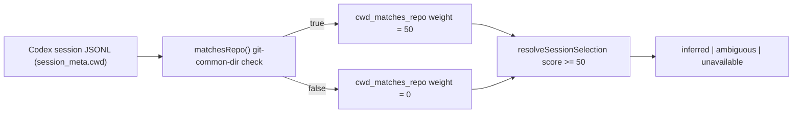

# Spec

## Required Behavior

- `matchesRepo(candidatePath, repoRoot)` remains the single source of truth for
  "is this cwd the same repository" (same resolved path, or same
  `git rev-parse --git-common-dir`). No change to its semantics.
- `summarizeSessionCandidate()` and `mergeSessionCandidateGroup()` assign
  `cwd_matches_repo ? 50 : 0` (raised from 45) toward the session score, so that a
  cwd match alone reaches the `resolveSessionSelection()` confidence threshold
  (`score < 50` is treated as low confidence) without requiring any other signal.
- `resolveSessionSelection()` threshold logic (`score < 50` => low confidence,
  ties => ambiguous) is otherwise unchanged.
- A session whose cwd does not match the repo (no shared git-common-dir, no same
  path) continues to score 0 for this component and is unaffected by this change.

## Invariants

- `INV-STCN-1`: `matchesRepo()` never treats two genuinely unrelated repositories
  (no shared git-common-dir) as matching.
- `INV-STCN-2`: Raising the cwd-match weight cannot cause a non-cwd-matching
  candidate to outscore a cwd-matching one it previously lost to.
- `INV-STCN-3`: Existing ambiguous-tie behavior (`SAI-SCENARIO-002`) and
  cross-repo-mismatch behavior (`SCATTR-SCENARIO-003`) are unchanged.

## Design Diagrams

### Data Flow

## Non Goals

- Does not change how `matchesRepo()` determines a match (git-common-dir logic
  is already correct and out of scope).
- Does not add new signals (story ref, window overlap, process cwd) or change
  their weights.
- Does not change behavior for explicit `--session-id` selection (bypasses
  inference entirely).
