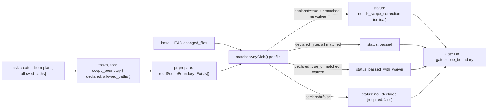
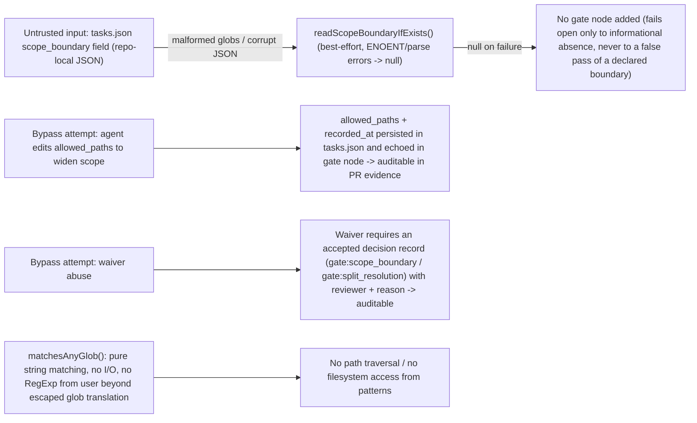

# Spec

## Required Behavior

### `vibepro task create --from-plan`

- Accepts `--allowed-paths <comma-separated-globs>`. Whitespace around each
  entry is trimmed; empty entries are dropped.
- For each Story processed by `createTasksFromPlan()`, the written
  `tasks.json` gains:
  ```json
  "scope_boundary": {
    "schema_version": "0.1.0",
    "declared": <boolean>,
    "allowed_paths": ["<glob>", ...],
    "source": "cli_declared" | "derived_from_target_files" | "none",
    "recorded_at": "<ISO 8601>"
  }
  ```
- `declared: true`, `source: "cli_declared"` when `--allowed-paths` is passed
  with at least one non-empty entry; `allowed_paths` is exactly the normalized
  CLI list (deduplicated, order preserved).
- Otherwise `declared: false`; `allowed_paths` is the deduplicated union of
  every selected task candidate's `target_files`, and `source` is
  `"derived_from_target_files"` when that union is non-empty, else `"none"`
  with `allowed_paths: []`.

### `vibepro pr prepare`

- Reads `scope_boundary` from `.vibepro/stories/<story-id>/tasks/tasks.json`
  for the resolved story (best-effort; missing file/field -> `scopeBoundary:
  null`, and no `gate:scope_boundary` node is added to the Gate DAG at all).
- When `scopeBoundary` is present, adds exactly one node:
  - `id: "gate:scope_boundary"`, `type: "scope_boundary_gate"`.
  - `required: false` when `scopeBoundary.declared === false` — the gate
    reports `status: "not_declared"` and is never part of
    `unresolved_gates`/`critical_unresolved_gates` regardless of matches
    (`INV-SBG-1`).
  - `required: true` when `scopeBoundary.declared === true`. Every changed file
    (from the same `changed_files` list already used for `fileGroups`,
    excluding `.vibepro/` workspace-artifact paths and test files matched by
    the existing `isTestFile` convention from `assertStrictTargetFiles`) is
    checked against `scopeBoundary.allowed_paths` with `matchesAnyGlob()`.
    - All matched -> `status: "passed"`.
    - Any unmatched, no accepted decision against `gate:scope_boundary` (or
      `gate:split_resolution`) -> `status: "needs_scope_correction"`,
      `out_of_scope_files: [...]` (workspace-relative), `required_actions`
      lists both "narrow the PR to the declared scope" and "update
      `--allowed-paths` / rerun `vibepro task create` and `pr prepare`".
    - Any unmatched, with an accepted decision against `gate:scope_boundary`
      or `gate:split_resolution` -> `status: "passed_with_waiver"`.
- `isCriticalUnresolvedGate()` treats `gate:scope_boundary` with
  `status === "needs_scope_correction"` as critical (`INV-SBG-2`), matching
  the severity of `gate:pr_scope_judgment`.
- `collectUnresolvedRequiredGates()` includes `scope_boundary_gate` in its
  known node-type allowlist so the gate can appear in
  `unresolved_gates`/`critical_unresolved_gates` when `required: true` and
  unresolved.

## Glob matching (`matchesAnyGlob`)

- `*` matches any run of characters except `/`.
- `**` matches any run of characters including `/` (including zero
  path segments).
- A pattern with no `*` is treated as an exact path match OR a directory
  prefix match when the pattern ends with `/` (e.g. `src/foo/` matches
  `src/foo/bar.js`).
- Matching is case-sensitive and always against the workspace-relative POSIX
  path (`/`-separated), independent of host OS path separators.

## Invariants

- `INV-SBG-1`: An undeclared `scope_boundary` (`declared: false`, or no
  `tasks.json` at all) never blocks `pr prepare`/`pr create` — the gate is
  either absent or `required: false`.
- `INV-SBG-2`: A declared `scope_boundary` with an unmatched changed file
  blocks PR creation unless an accepted decision record targets
  `gate:scope_boundary` or `gate:split_resolution`.
- `INV-SBG-3`: `matchesAnyGlob()` is pure and synchronous; it performs no I/O
  and never throws for well-formed string inputs.

## Design Diagrams

### flow



### threat_model



## Non Goals

- Does not modify or remove the existing `assertStrictTargetFiles()` /
  `pr prepare --strict --task` hard-throw path.
- Does not enforce boundaries across multiple concurrent worktrees at the
  filesystem/git level (no pre-commit hook); this is a `pr prepare`-time
  check only.
- Does not support per-task (only per-story) scope boundaries in this Story.
