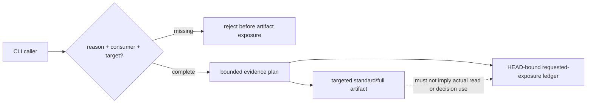

# Spec

## Contracts

- `SDL-CONTRACT-001`: `buildEvidencePlan` MUST default every implicit request to `summary`, including source and high-risk changes.
- `SDL-CONTRACT-002`: summary plans MUST preserve risk signals and targeted full surfaces in compact machine-readable artifacts.
- `SDL-CONTRACT-003`: explicit `standard` or `full` MUST require non-empty reason, consumer, and at least one target path or gate id.
- `SDL-CONTRACT-004`: each valid non-summary override MUST append a HEAD-bound entry to `evidence-drilldown-log.json`.
- `SDL-CONTRACT-005`: a summary run MUST NOT append a drill-down entry or erase prior entries.
- `SDL-CONTRACT-006`: the ledger MUST describe requested exposure only and MUST NOT claim actual reads or decision use.

## Code And Test References

- `src/evidence-depth-planner.js`: policy, validation, ledger entry model.
- `src/pr-manager.js`: ledger persistence and manifest/artifact exposure.
- `src/cli.js`: `--evidence-depth-target` parsing and help.
- `test/evidence-depth-planner.test.js`: policy and validation scenarios.
- `test/evidence-depth-pr-prepare.test.js`: end-to-end persistence scenarios.

## Verification

- `SDL-VERIFY-001`: source/high-risk defaults remain summary while risk surfaces remain present.
- `SDL-VERIFY-002`: incomplete standard/full requests fail with all missing field names.
- `SDL-VERIFY-003`: two explicit drill-down runs produce two ordered entries with target, reason, consumer, and HEAD.
- `SDL-VERIFY-004`: existing evidence-depth and traceability suites remain green after callers provide bounded targets.

## Diagrams

### Threat Model

The trust boundary is the explicit override request. Missing attribution fails closed, and the ledger records requested exposure without promoting it to read telemetry or decision evidence.
