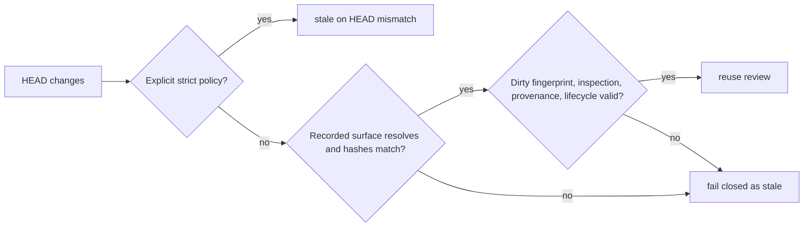

# Surface-aware Agent Review Freshness Spec

## Invariants

- `SARF-INV-1`: `gate_evidence` and `release_risk` MUST default to `content_surface`.
- `SARF-INV-2`: A content-surface pass MUST remain current across HEAD changes only while every recorded surface file exists and the aggregate surface hash and dirty fingerprint match.
- `SARF-INV-3`: Missing/unbound surfaces, hash mismatches, unresolved legacy merge deltas, or provenance/lifecycle failures MUST fail closed.
- `SARF-INV-4`: A role policy or CLI strict override with an explicit reason MUST remain HEAD-bound.

## Scenarios

- `SARF-S-1`: Given passing `gate_evidence` and `release_risk` reviews with concrete inspection inputs, when main advances and the branch is rebased or merged without changing those inputs, then both roles remain passing with content-surface freshness.
- `SARF-S-2`: Given the same reviews, when a reviewed implementation, contract, projection lineage source, or release-impact input changes, then the impacted role becomes stale.
- `SARF-S-3`: Given a legacy review whose recorded HEAD cannot be diffed, when HEAD changes, then the review becomes stale with an unresolved merge-delta reason.
- `SARF-S-4`: Given a reasoned strict override, when any commit changes HEAD, then the review becomes stale even if its inspected file hash is unchanged.

## Threat Model

## Code and Test References

- `src/agent-review.js`: `getRolePolicy`, `resolveReviewFreshnessPolicy`, `bindReviewResult`, `evaluateMergeDeltaReviewReuse`
- `src/content-binding.js`: `buildContentBinding`, `evaluateContentBinding`
- `test/content-scoped-evidence-freshness.test.js`
- `test/vibepro-cli.test.js`
- `test/e2e/story-vibepro-surface-aware-agent-review-freshness-main.spec.ts`
